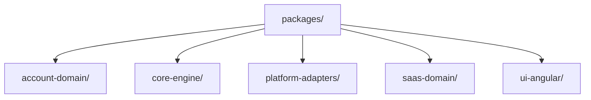

<!-- markdownlint-disable-file -->
# Research: Mermaid file tree diagram for packages folder

## Documentation Sources
- docs/Mermaid.md – consolidated overview，包含現行的 Packages Directory Tree 區塊（含預留 src/ 與 @google/genai 節點）。
- docs/Mermaid-A.md / docs/Mermaid-B.md / docs/Mermaid-C.md – 主要架構與事件流程的 Mermaid 範本。
- docs/Mermaid-架構層.md / docs/Mermaid-基礎設施層.md / docs/Mermaid-概念層.md / docs/Mermaid-實作指引.md / docs/Mermaid-模組層.md / docs/Mermaid-總結層.md – 分層說明與詞彙來源，新增圖表時沿用相同術語。

## Tools and Findings
- `ls packages` 確認現有套件資料夾：`account-domain`、`core-engine`、`platform-adapters`、`saas-domain`、`ui-angular`。
- `sed -n '1,240p' docs/Mermaid.md` 檢視現有 Mermaid 區段；該檔案已包含 Packages Directory Tree Mermaid 區塊，並預留 src/ 子節點與 `platform-adapters/@google/genai` 節點。
- 其他 Mermaid-* 文件提供分層/模組語彙（Identity、Workspace、Module 等），新增描述時保持一致。

## Project Structure Analysis
- 主要更新檔案：`docs/Mermaid.md`（收錄多個 Mermaid 圖表與風格）。
- 相關目錄：
  - `packages/account-domain`
  - `packages/core-engine`
  - `packages/platform-adapters`
  - `packages/saas-domain`
  - `packages/ui-angular`

## Mermaid Directory Tree Pattern
一個簡單的目錄樹可使用 `flowchart TD` 描述：

Notes:
- 保留引號以顯示斜線，縮排與現有 Mermaid.md 保持一致。
- 目前文件中的 Packages Directory Tree 也標記了各套件的 src/ 預留節點與 `@google/genai` 子樹，必要時可沿用。

## External Reference
- Mermaid flowchart 語法：https://mermaid.js.org/syntax/flowchart.html

## Implementation Guidance
- 新區塊放在 Mermaid.md 末端附近；標題使用 `##`，段落描述簡短。
- 使用與其他 Mermaid 區段一致的縮排與 fenced code block (` ```mermaid `)。
- 若延伸子節點（如 src/ 或 @google/genai），維持現有文件的命名與層級。
