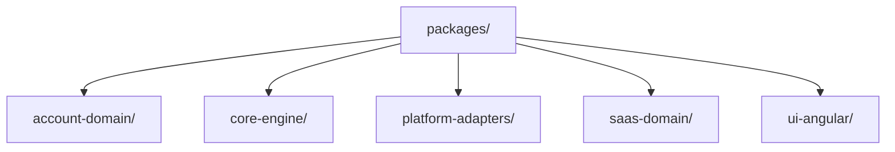

<!-- markdownlint-disable-file -->
# Research: Mermaid file tree diagram for packages folder

## Tools and Findings
- `ls packages` to confirm existing package folders: `account-domain`, `core-engine`, `platform-adapters`, `saas-domain`, `ui-angular`, plus repository docs (`AGENTS.md`, `README.md`).
- `sed -n '1,200p' Mermaid.md` to inspect current Mermaid diagrams and formatting; file uses markdown headings plus ```mermaid``` code blocks for flowcharts/class diagrams.

## Project Structure Analysis
- Root file to update: `Mermaid.md` already holds multiple Mermaid diagrams grouped under headings (Event Flow, Workspace, etc.).
- Relevant directories under `packages/` confirmed on disk:
  - `packages/account-domain`
  - `packages/core-engine`
  - `packages/platform-adapters`
  - `packages/saas-domain`
  - `packages/ui-angular`
- Existing markdown style: heading (##) followed by description/list and Mermaid code block fenced with ```mermaid```.

## Mermaid Directory Tree Pattern
A simple directory tree can be expressed with `flowchart TD` using nodes per folder:

Notes:
- Quoted labels keep slashes visible.
- Keep indentation consistent with existing diagrams in `Mermaid.md`.

## External Reference
- Mermaid official docs for flowcharts: https://mermaid.js.org/syntax/flowchart.html (supports directional trees and quoted labels).

## Implementation Guidance
- Add a new section near the end of `Mermaid.md` titled "Packages Directory Tree" to document the requested folders.
- Use a short bullet list (optional) to clarify scope, then include the mermaid code block using the pattern above.
- Keep formatting consistent with other sections (heading `##`, code fence ` ```mermaid `, 4-space indentation for nodes).
