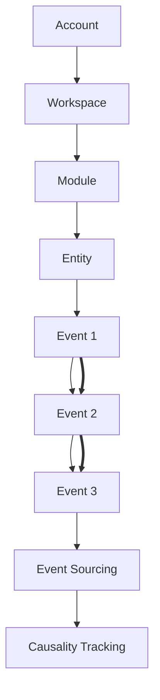

# ng-dragon AGENTS.md - Package Boundaries for AI Copilot

> **此文件是為 AI 代理（GitHub Copilot 等）設計的架構邊界指南，確保零認知代碼生成時能遵守正確的分層與依賴規則。**

## 📖 Table of Contents

1. [Architecture Overview](#architecture-overview)
2. [Package Structure](#package-structure)
3. [Dependency Rules](#dependency-rules)
4. [SDK Isolation Rules](#sdk-isolation-rules)
5. [Per-Package Boundaries](#per-package-boundaries)
6. [Event Flow & Causality](#event-flow--causality)
7. [Anti-Patterns](#anti-patterns)
8. [Code Generation Guidelines](#code-generation-guidelines)

---

## Architecture Overview

ng-dragon is a **DDD + Event Sourcing + CQRS** monorepo with strict layer boundaries:

```
┌─────────────────────────────────────────────────────┐
│                   ui-angular                        │
│            (Angular Frontend Layer)                 │
└─────────────────┬───────────────────────────────────┘
                  │
┌─────────────────▼───────────────────────────────────┐
│              platform-adapters                      │
│     (Firebase, AI, External APIs - SDK Layer)       │
└─────────────┬───────────────┬───────────────────────┘
              │               │
┌─────────────▼───────────┐   │
│      core-engine        │   │
│  (CQRS/ES Infrastructure)◄──┘
└─────────────┬───────────┘
              │
    ┌─────────┴──────────┐
    │                    │
┌───▼──────────┐  ┌──────▼──────────┐
│account-domain│  │  saas-domain    │
│ (Identity)   │  │(Business Logic) │
└──────────────┘  └─────────────────┘
```

### Core Principle: Unidirectional Dependency

```
account-domain ──┐
                 ├──> saas-domain ──> ui-angular
                 │         ▲
                 └──> core-engine <── platform-adapters
```

**Golden Rule**: Domain packages (account-domain, saas-domain) NEVER depend on infrastructure or UI.

---

## Package Structure

```
packages/
├── account-domain/       # 🧠 Identity & Account Core Domain
│   └── src/
│       ├── aggregates/   # Account, Organization, User, Workspace
│       ├── value-objects/# Roles, module types, workspace types
│       ├── events/       # Domain events + metadata helpers
│       ├── policies/     # Cross-aggregate guards
│       ├── repositories/ # Interfaces only
│       ├── domain-services/
│       ├── entities/
│       └── types/
│
├── saas-domain/          # 🏢 SaaS Business Domain
│   └── src/
│       ├── aggregates/   # Task, Issue, Finance, Quality, Acceptance
│       ├── value-objects/
│       ├── events/
│       ├── domain-services/
│       ├── repositories/ # Interfaces only
│       ├── entities/
│       └── policies/     # Module dependency rules
│
├── core-engine/          # ⚡ CQRS/ES Infrastructure
│   └── src/
│       ├── commands/     # Command definitions
│       ├── queries/      # Query definitions
│       ├── use-cases/    # Application services (pure TS)
│       ├── ports/        # EventStore, Projection interfaces
│       ├── mappers/      # DTO ↔ Domain conversion
│       ├── dtos/
│       ├── jobs/
│       └── schedulers/
│
├── platform-adapters/    # 🔌 Infrastructure Implementation
│   └── src/
│       ├── firebase-platform/ # firebase-admin base layer
│       ├── auth/         # Authentication bridging
│       ├── messaging/    # Push notifications, event publishing
│       ├── ai/           # AI/LLM abstractions
│       ├── external-apis/
│       │   └── google/genai/ # Google GenAI/Vertex AI
│       └── persistence/  # EventStore, Projection, DB adapters
│
└── ui-angular/           # 🎨 User Interface
    └── (located at /src/app)
        ├── adapters/     # Facades wrapping platform-adapters
        ├── features/     # Task, Issue, Finance, etc. UI modules
        ├── core/         # i18n, startup, guards, state
        ├── routes/
        ├── shared/
        └── layout/
```

---

## Dependency Rules

### ✅ Allowed Dependencies

| Package | Can Import From |
|---------|----------------|
| **account-domain** | TypeScript stdlib ONLY |
| **saas-domain** | TypeScript stdlib, account-domain |
| **core-engine** | TypeScript stdlib, account-domain, saas-domain |
| **platform-adapters** | All packages + External SDKs |
| **ui-angular** | @angular/*, @angular/fire, platform-adapters facades |

### ❌ Forbidden Dependencies

| Package | MUST NOT Import |
|---------|----------------|
| **account-domain** | Any SDK, Angular, Firebase, core-engine, platform-adapters |
| **saas-domain** | Any SDK, Angular, Firebase, core-engine, platform-adapters |
| **core-engine** | Any SDK, Angular, Firebase, platform-adapters |
| **platform-adapters** | Domain logic from account/saas domains |
| **ui-angular** | firebase-admin, direct core-engine imports |

---

## SDK Isolation Rules

### 🔐 The Golden Rule: SDK Isolation

**Only `platform-adapters` may import external SDKs.**

| Layer | Allowed Imports | Forbidden | Explanation |
|-------|----------------|-----------|-------------|
| **domain** (account/saas) | TypeScript stdlib only | All SDKs, frameworks | Pure business logic |
| **core-engine** | TypeScript stdlib, domain types | All SDKs, frameworks | Pure infrastructure patterns |
| **platform-adapters** | All SDKs (firebase-admin, Google AI, etc.) | None | **Only SDK entry point** |
| **ui-angular** | @angular/*, @angular/fire, platform-adapters | firebase-admin, core-engine direct | Frontend uses facades |

### SDK Separation Matrix

```typescript
// ✅ ALLOWED in platform-adapters ONLY
import { initializeApp } from 'firebase-admin/app';
import { getFirestore } from 'firebase-admin/firestore';
import { VertexAI } from '@google-cloud/vertexai';

// ❌ FORBIDDEN in domain/core-engine
import { Firestore } from 'firebase-admin/firestore'; // NO!
import * as admin from 'firebase-admin'; // NO!
```

---

## Per-Package Boundaries

### 🧠 account-domain

**Mission**: Define identity, account, organization, workspace, and module enablement models.

#### ✅ Allowed
- Aggregate: Account, Organization, User, Workspace, ModuleRegistry
- Value Objects: Role, ModuleType, WorkspaceType
- Domain Events: AccountCreated, WorkspaceCreated, ModuleEnabled
- Domain Services: Membership validation, module dependency checks
- Repository Interfaces (no implementation)

#### ❌ Forbidden
- Firebase, Angular, HTTP, any SDK
- Direct database access
- JSON API DTOs (use in adapters layer)
- Time/UUID generation (inject via factories)

#### Code Example

```typescript
// ✅ GOOD - Pure domain aggregate
export class Account extends AggregateRoot {
  private constructor(
    public readonly id: AccountId,
    public readonly email: Email,
    public readonly status: AccountStatus
  ) {
    super();
  }

  static create(id: AccountId, email: Email): Account {
    const account = new Account(id, email, AccountStatus.Active);
    account.addDomainEvent(new AccountCreated(id, email));
    return account;
  }
}

// ❌ BAD - SDK usage in domain
import { Firestore } from 'firebase-admin/firestore'; // NO!
export class Account {
  async save() {
    await Firestore().collection('accounts').doc(this.id).set(...); // NO!
  }
}
```

---

### 🏢 saas-domain

**Mission**: Model SaaS business capabilities (Tasks, Issues, Finance, Quality, Acceptance).

#### ✅ Allowed
- Aggregates: Task, Issue, Payment, QualityMetric, AcceptanceCriteria
- Value Objects: TaskStatus, Priority, Currency
- Domain Events: TaskCreated, IssueResolved, PaymentProcessed
- Module dependency policies
- Repository Interfaces

#### ❌ Forbidden
- Any SDK, UI frameworks
- Workspace creation logic (belongs to account-domain)
- Direct adapter calls

#### Code Example

```typescript
// ✅ GOOD - Business domain aggregate
export class Task extends AggregateRoot {
  private constructor(
    public readonly id: TaskId,
    public readonly workspaceId: WorkspaceId,
    private status: TaskStatus
  ) {
    super();
  }

  complete(): void {
    if (this.status === TaskStatus.Completed) {
      throw new DomainError('Task already completed');
    }
    this.status = TaskStatus.Completed;
    this.addDomainEvent(new TaskCompleted(this.id, this.workspaceId));
  }
}

// ❌ BAD - Creating workspace in saas-domain
export class Task {
  createWorkspace() { // NO! Workspace belongs to account-domain
    return new Workspace(...);
  }
}
```

---

### ⚡ core-engine

**Mission**: Provide CQRS/Event Sourcing infrastructure (command bus, event dispatcher, ports).

#### ✅ Allowed
- Command Bus, Event Bus interfaces
- Saga/Process Manager patterns
- Port definitions (EventStore, Projection)
- Unit of Work pattern
- Pure TypeScript coordination logic

#### ❌ Forbidden
- Business rules (e.g., `if workspace.isPaid`)
- Any SDK (Firebase, Angular, etc.)
- UI Models
- Direct implementation of ports (belongs in platform-adapters)

#### Code Example

```typescript
// ✅ GOOD - Pure infrastructure port
export interface EventStore {
  append(aggregateId: string, events: DomainEvent[]): Promise<void>;
  loadEvents(aggregateId: string): Promise<DomainEvent[]>;
}

// ✅ GOOD - Pure command handler interface
export interface CommandHandler<T extends Command> {
  handle(command: T): Promise<void>;
}

// ❌ BAD - Business logic in core-engine
export class CommandBus {
  async execute(command: Command) {
    if (command.workspace.isPaid) { // NO! Business logic belongs in domain
      // ...
    }
  }
}
```

---

### 🔌 platform-adapters

**Mission**: Implement ports using external SDKs. **Only place where SDKs are allowed.**

#### ✅ Allowed
- firebase-admin (app, auth, firestore, storage, messaging, pubsub)
- Google GenAI/Vertex AI SDK
- HTTP clients
- Cloud Tasks, PubSub
- Repository implementations
- Adapter pattern for external APIs

#### ❌ Forbidden
- Domain logic (aggregates, validation rules)
- Business decisions (leave to domain services)

#### Code Example

```typescript
// ✅ GOOD - Adapter implementing domain port
import { Firestore, getFirestore } from 'firebase-admin/firestore';
import { WorkspaceRepository } from '@account-domain/repositories';

export class FirestoreWorkspaceRepository implements WorkspaceRepository {
  private firestore: Firestore;

  constructor() {
    this.firestore = getFirestore();
  }

  async save(workspace: Workspace): Promise<void> {
    // Map domain model to Firestore document
    const doc = this.mapToFirestoreDoc(workspace);
    await this.firestore.collection('workspaces').doc(workspace.id).set(doc);
  }
}

// ❌ BAD - Business logic in adapter
export class FirestoreWorkspaceRepository {
  async save(workspace: Workspace): Promise<void> {
    if (workspace.isPaid && workspace.modules.length > 5) { // NO! Domain logic
      throw new Error('Paid workspaces cannot have more than 5 modules');
    }
    // ...
  }
}
```

---

### 🎨 ui-angular

**Mission**: Angular frontend, using facades to access backend capabilities.

#### ✅ Allowed
- @angular/* packages
- @angular/fire (Firestore client SDK)
- platform-adapters facades
- Components, Services, Guards, Pipes
- View Models, DTOs for UI

#### ❌ Forbidden
- firebase-admin (server-side SDK)
- Direct core-engine imports
- Direct domain aggregate mutations
- Direct Firestore writes without facades

#### Code Example

```typescript
// ✅ GOOD - Using facade
import { inject } from '@angular/core';
import { CoreEngineFacade } from '@app/adapters/core-engine.facade';

@Component({
  selector: 'app-tasks-page',
  template: `...`
})
export class TasksPageComponent {
  private facade = inject(CoreEngineFacade);

  loadTasks(workspaceId: string) {
    return this.facade.getTasks(workspaceId);
  }

  completeTask(taskId: string) {
    this.facade.executeCommand(new CompleteTaskCommand(taskId));
  }
}

// ❌ BAD - Direct SDK usage
import { Firestore } from '@angular/fire/firestore';
import { collection, getDocs } from '@angular/fire/firestore';

@Component({...})
export class TasksPageComponent {
  private firestore = inject(Firestore);

  async loadTasks() {
    const snapshot = await getDocs(collection(this.firestore, 'tasks')); // NO!
  }
}
```

---

## Event Flow & Causality

### Event Sourcing Pattern

```
User Action → Command → Aggregate → Domain Event → Event Store
                                         ↓
                                   Projections (Read Models)
```

### Causality Tracking

All events carry causality metadata:

```typescript
export interface DomainEvent {
  eventId: string;
  eventType: string;
  aggregateId: string;
  occurredAt: string; // ISO 8601
  causationId?: string; // Event that caused this event
  correlationId?: string; // Original request/command ID
  metadata?: Record<string, unknown>;
}
```

### Event Flow Diagram



### Dependency Direction: Account → Workspace → Module → Entity

- **Account** creates **Workspace**
- **Workspace** enables **Module**
- **Module** manages **Entity**
- Each layer only "uses" the right, never knows about the left

---

## Anti-Patterns

### ❌ Absolute DON'Ts

#### 1. SDK in Domain

```typescript
// ❌ BAD
import { Firestore } from 'firebase-admin/firestore';
export class Account {
  async save() {
    await Firestore().collection('accounts').add(this); // NO!
  }
}

// ✅ GOOD
export interface AccountRepository {
  save(account: Account): Promise<void>;
}
// Implementation in platform-adapters
```

#### 2. Business Logic in Adapters

```typescript
// ❌ BAD
export class FirestoreTaskRepository {
  async save(task: Task) {
    if (task.priority === Priority.High && task.assignee === null) { // NO!
      throw new Error('High priority tasks must have assignee');
    }
    await this.firestore.collection('tasks').doc(task.id).set(...);
  }
}

// ✅ GOOD - Business rule in domain
export class Task {
  assign(assignee: UserId): void {
    if (this.priority === Priority.High && !assignee) {
      throw new DomainError('High priority tasks must have assignee');
    }
    this.assignee = assignee;
  }
}
```

#### 3. Direct Firestore in UI

```typescript
// ❌ BAD
import { Firestore } from '@angular/fire/firestore';
@Component({...})
export class TasksComponent {
  async createTask() {
    await this.firestore.collection('tasks').add({...}); // NO!
  }
}

// ✅ GOOD - Use facade
@Component({...})
export class TasksComponent {
  createTask() {
    this.facade.executeCommand(new CreateTaskCommand(...));
  }
}
```

#### 4. Module Creating Workspace

```typescript
// ❌ BAD - Module should never create Workspace
export class TaskModule {
  createWorkspace() { // NO!
    return new Workspace(...);
  }
}

// ✅ GOOD - Workspace creates modules
export class Workspace {
  enableModule(moduleType: ModuleType) {
    // Workspace decides which modules to enable
  }
}
```

#### 5. Domain Using new Date() or uuid()

```typescript
// ❌ BAD
export class Account {
  static create(email: Email) {
    const id = crypto.randomUUID(); // NO! Non-deterministic
    const createdAt = new Date().toISOString(); // NO!
    return new Account(id, email, createdAt);
  }
}

// ✅ GOOD - Inject via factory
export class AccountFactory {
  constructor(
    private idGenerator: IdGenerator,
    private clock: Clock
  ) {}

  create(email: Email): Account {
    const id = this.idGenerator.generate();
    const createdAt = this.clock.now();
    return Account.reconstitute(id, email, createdAt);
  }
}
```

---

## Code Generation Guidelines

### When Copilot Generates Domain Code

1. **Check imports**: Only TypeScript stdlib allowed
2. **No SDK references**: No Firebase, Angular, HTTP clients
3. **Pure business logic**: Domain rules, invariants, validations
4. **Immutable value objects**: Use readonly properties
5. **Event emission**: Use `addDomainEvent()` for state changes
6. **Repository interfaces only**: Never implement in domain

### When Copilot Generates Adapter Code

1. **SDK imports allowed**: This is the ONLY place
2. **Implement domain ports**: Never define business rules
3. **Map domain ↔ infrastructure**: DTOs, documents, API models
4. **Handle technical errors**: Network, DB, API failures
5. **No business validation**: Leave to domain

### When Copilot Generates UI Code

1. **Use facades**: Never direct core-engine or SDK calls
2. **View models for UI**: Not domain entities directly
3. **@angular/fire allowed**: For client-side Firebase
4. **Command pattern**: For user actions
5. **No firebase-admin**: Server SDK forbidden in frontend

### Testing Guidelines

- **Domain**: Pure unit tests, no mocks needed
- **Core-engine**: Test coordination logic with test doubles
- **Adapters**: Integration tests with real/fake SDKs
- **UI**: Component tests with mocked facades

---

## Workspace / Module Rules

### Core Rule: Modules Never Create Workspaces

> **Workspace is the shell, Module is the plugin, Account is the hand, Event is the cause.**

1. **Workspace owns module registry**: Workspace doesn't know how modules work, but knows which are installed
2. **Modules declare mount conditions**: Each module declares "when can I be installed in a Workspace"
3. **Workspace validates**: Workspace checks conditions but doesn't understand business logic
4. **Module enablement is an Event**: Not a configuration
5. **Modules consume Workspace context**: Modules always operate within Workspace boundaries
6. **Modules never know "outside Workspace"**

### Workspace Module Enablement Flow

```
1️⃣ Command arrives
2️⃣ Workspace Aggregate validates
3️⃣ Workspace emits ModuleEnabledEvent
4️⃣ Module "listens" and initializes itself
```

**Modules are passive, never take control.**

### ❌ Forbidden Module Behaviors

- ❌ Module creating Workspace
- ❌ Module peeking at other module state (only via manifest dependency declaration)
- ❌ Module knowing about Account/Organization directly

---

## Request Flow Example: Create Workspace

```
UI (Angular Component)
  → Send CreateWorkspaceCommand
    → core-engine (CommandBus)
      → Application Handler (platform-adapters)
        → WorkspaceFactory (account-domain)
          → Workspace Aggregate
            → WorkspaceCreatedEvent
        → WorkspaceRepository.save()
          → FirestoreWorkspaceRepository (platform-adapters)
            → Firestore.collection('workspaces').add(...)
```

**Notice**: Domain logic stays in domain, SDK usage stays in adapters.

---

## Summary Checklist for Copilot

When generating code for ng-dragon, ensure:

- [ ] **Domain packages**: Zero SDK imports, pure TypeScript
- [ ] **Core-engine**: No business logic, only coordination
- [ ] **Platform-adapters**: Only layer with SDK imports
- [ ] **UI**: Uses facades, no direct SDK except @angular/fire
- [ ] **Dependency flow**: Always domain ← core ← adapters → UI
- [ ] **Event-driven**: All state changes emit domain events
- [ ] **Immutability**: Value objects and events are immutable
- [ ] **Type safety**: Full TypeScript strict mode compliance
- [ ] **Testing**: Unit tests for domain, integration for adapters
- [ ] **Documentation**: Update relevant README/AGENTS when adding features

---

**This document ensures Copilot generates code that respects architectural boundaries with zero prior knowledge of the codebase.**

> Last Updated: 2024-01-10
> Source of Truth: [packages/AGENTS.md](packages/AGENTS.md)
