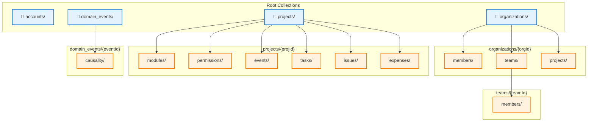

# Project Architecture Design (Firestore Version)

## Core Concepts

### Identity vs Workspace Separation
- **Account** = 登入主體 (User, Bot)
- **Organization** = 實體容器 (擁有 Teams 和 Projects)
- **Workspace** = 邏輯容器 (Project 或 Personal Space)
- **Actor** = 操作執行者 (必定是 User 或 Bot，永遠不是 Organization)

### Key Principles
1. Organization 是資源擁有者，但不是 Actor
2. User 代表 Organization 執行操作
3. Project 繼承 Organization/Team 的權限
4. Event 必須記錄完整的層級關係 (Organization → Project → Module → Entity)

### Firestore vs Supabase 差異

| 面向 | Supabase (關聯式) | Firestore (文件式) |
|------|------------------|-------------------|
| 資料結構 | 正規化表格 + Foreign Keys | 非正規化文件 + 內嵌/引用 |
| 查詢方式 | SQL JOIN | Collection Group Query + 反正規化 |
| 事務處理 | ACID 保證 | 最多 500 文件寫入限制 |
| 索引 | 手動建立 | 自動單欄位 + 複合索引配置 |
| 權限控制 | RLS (Row Level Security) | Security Rules (文件層級) |
| Event Sourcing | 天然支援 (Append-only) | 需要設計 subcollection |
| 跨專案查詢 | 簡單 (WHERE organization_id) | 困難 (需要反正規化) |

---

## Firestore Collection Structure



---

## Firestore Data Model

### 1. Accounts (Root Collection)

```typescript
// Collection: accounts/{accountId}
interface AccountDoc {
  accountId: string;  // = document ID
  accountType: 'user' | 'bot';
  email: string;
  displayName: string;
  photoURL?: string;
  
  // ✅ 反正規化：快速查詢所屬組織
  organizationMemberships: {
    [orgId: string]: {
      role: 'owner' | 'admin' | 'member';
      joinedAt: Timestamp;
    };
  };
  
  // ✅ 反正規化：快速查詢團隊
  teamMemberships: {
    [teamId: string]: {
      organizationId: string;
      role: 'maintainer' | 'member';
      joinedAt: Timestamp;
    };
  };
  
  // ✅ 反正規化：快速查詢專案權限
  projectPermissions: {
    [projectId: string]: {
      role: 'owner' | 'admin' | 'write' | 'read';
      grantedAt: Timestamp;
      source: 'direct' | 'org' | 'team';  // 權限來源
    };
  };
  
  createdAt: Timestamp;
  updatedAt: Timestamp;
}

// 範例文件
{
  accountId: "user_alice",
  accountType: "user",
  email: "alice@example.com",
  displayName: "Alice",
  organizationMemberships: {
    "org_acme": {
      role: "admin",
      joinedAt: Timestamp
    }
  },
  teamMemberships: {
    "team_engineering": {
      organizationId: "org_acme",
      role: "maintainer",
      joinedAt: Timestamp
    }
  },
  projectPermissions: {
    "proj_website": {
      role: "admin",
      grantedAt: Timestamp,
      source: "team"  // 來自 team_engineering
    }
  }
}
```

### 2. Organizations (Root Collection)

```typescript
// Collection: organizations/{organizationId}
interface OrganizationDoc {
  organizationId: string;  // = document ID
  slug: string;
  displayName: string;
  ownerId: string;  // -> accounts/{accountId}
  
  // ✅ 反正規化：快速計數
  stats: {
    memberCount: number;
    teamCount: number;
    projectCount: number;
  };
  
  createdAt: Timestamp;
  updatedAt: Timestamp;
}

// Subcollection: organizations/{orgId}/members/{accountId}
interface OrgMemberDoc {
  accountId: string;  // = document ID
  role: 'owner' | 'admin' | 'member';
  joinedAt: Timestamp;
  
  // ✅ 反正規化：避免多次查詢
  accountInfo: {
    email: string;
    displayName: string;
    photoURL?: string;
  };
}

// Subcollection: organizations/{orgId}/teams/{teamId}
interface TeamDoc {
  teamId: string;  // = document ID
  organizationId: string;  // ✅ 冗餘但必要（用於 Collection Group Query）
  slug: string;
  displayName: string;
  defaultPermission: 'admin' | 'write' | 'read' | 'none';
  
  // ✅ 反正規化：快速計數
  memberCount: number;
  
  createdAt: Timestamp;
}

// Subcollection: organizations/{orgId}/teams/{teamId}/members/{accountId}
interface TeamMemberDoc {
  accountId: string;  // = document ID
  teamId: string;  // ✅ 冗餘（用於 Collection Group Query）
  organizationId: string;  // ✅ 冗餘（用於查詢）
  role: 'maintainer' | 'member';
  joinedAt: Timestamp;
  
  // ✅ 反正規化
  accountInfo: {
    displayName: string;
    photoURL?: string;
  };
}

// Subcollection: organizations/{orgId}/projects/{projectId}
// ⚠️ 注意：這是 "反向索引"，實際專案資料在 projects/ root collection
interface OrgProjectIndexDoc {
  projectId: string;  // = document ID
  name: string;
  slug: string;
  createdAt: Timestamp;
}
```

### 3. Projects (Root Collection)

```typescript
// Collection: projects/{projectId}
interface ProjectDoc {
  projectId: string;  // = document ID
  name: string;
  slug: string;
  
  // ✅ 明確的歸屬關係
  belongsTo: {
    type: 'organization' | 'user';
    id: string;  // organizationId or accountId
    displayName: string;  // ✅ 反正規化
  };
  
  // ✅ 反正規化：避免查詢 organization 文件
  organizationId?: string;  // 若是組織專案
  personalUserId?: string;  // 若是個人專案
  
  // ✅ 快速權限檢查（在 Security Rules 中使用）
  permissionIndex: {
    [accountId: string]: 'owner' | 'admin' | 'write' | 'read';
  };
  
  stats: {
    memberCount: number;
    moduleEnabledCount: number;
    taskCount: number;
    issueCount: number;
  };
  
  createdAt: Timestamp;
  updatedAt: Timestamp;
}

// Subcollection: projects/{projId}/permissions/{permissionId}
interface ProjectPermissionDoc {
  permissionId: string;  // = document ID (自動生成)
  projectId: string;  // ✅ 冗餘（用於 Collection Group Query）
  
  grantedTo: {
    type: 'user' | 'team';
    id: string;  // accountId or teamId
    displayName: string;  // ✅ 反正規化
  };
  
  role: 'owner' | 'admin' | 'write' | 'read';
  grantedAt: Timestamp;
  grantedBy: string;  // accountId
}

// Subcollection: projects/{projId}/modules/{moduleKey}
interface ModuleStatusDoc {
  moduleKey: string;  // = document ID (e.g., "task-module")
  projectId: string;  // ✅ 冗餘
  moduleType: 'core' | 'addon' | 'beta';
  enabled: boolean;
  
  // ✅ Module 依賴資訊（反正規化）
  dependencies: {
    required: string[];
    optional: string[];
  };
  
  enabledAt?: Timestamp;
  disabledAt?: Timestamp;
}
```

### 4. Domain Events (Root Collection + Subcollection)

```typescript
// Collection: domain_events/{eventId}
// ⚠️ 關鍵設計決策：使用 Root Collection + 反正規化
interface DomainEventDoc {
  eventId: string;  // = document ID
  eventType: string;  // "task.created", "issue.referenced", etc.
  aggregateId: string;
  
  // ✅ Event Scope（用於查詢）
  scope: {
    projectId: string;
    organizationId?: string;  // ⚠️ Firestore 不支援 NULL 查詢，用空字串
    personalUserId?: string;
  };
  
  moduleKey?: string;  // "task-module", "issue-module", etc.
  
  // Metadata
  actorId: string;
  actorType: 'user' | 'bot' | 'system';
  traceId: string;
  
  // ✅ Causality（簡化版）
  causality: {
    causedBy: string[];  // eventId[]
    affects: string[];   // entityId[]
    type: 'direct' | 'cascading' | 'cross_module' | 'automation';
  };
  
  // Payload（完整事件資料）
  payload: Record<string, any>;
  metadata: Record<string, any>;
  
  timestamp: Timestamp;
  
  // ✅ 複合索引欄位（加速查詢）
  _indexProjectModule: string;  // `${projectId}_${moduleKey}`
  _indexOrgTime: string;  // `${organizationId}_${timestamp.toMillis()}`
}

// Subcollection: projects/{projId}/events/{eventId}
// ✅ 專案內的事件索引（快速查詢專案歷史）
interface ProjectEventIndexDoc {
  eventId: string;  // = document ID
  eventType: string;
  moduleKey?: string;
  timestamp: Timestamp;
  
  // ✅ 輕量化：不包含完整 payload
}

// Subcollection: domain_events/{eventId}/causality/{causalityId}
// ✅ 複雜的因果關係（如果需要詳細追蹤）
interface EventCausalityDoc {
  causalityId: string;  // = document ID (自動生成)
  eventId: string;  // ✅ 冗餘
  causedByEventId?: string;
  affectsEntityId?: string;
  causalityType: 'direct' | 'cascading' | 'cross_module' | 'automation';
  createdAt: Timestamp;
}
```

### 5. Module Entities (Subcollections under projects/)

```typescript
// Collection: projects/{projId}/tasks/{taskId}
interface TaskDoc {
  taskId: string;  // = document ID
  projectId: string;  // ✅ 冗餘（用於 Collection Group Query）
  organizationId?: string;  // ✅ 冗餘（用於跨專案查詢）
  
  title: string;
  description: string;
  status: 'todo' | 'in_progress' | 'done';
  
  assigneeId?: string;
  assigneeInfo?: {  // ✅ 反正規化
    displayName: string;
    photoURL?: string;
  };
  
  // ✅ 跨模組引用
  relatedIssueId?: string;
  relatedIssueRef?: {  // ✅ 反正規化
    issueNumber: number;
    title: string;
    projectId: string;
  };
  
  createdAt: Timestamp;
  updatedAt: Timestamp;
  createdBy: string;  // accountId
}

// Collection: projects/{projId}/issues/{issueId}
interface IssueDoc {
  issueId: string;  // = document ID
  projectId: string;  // ✅ 冗餘
  organizationId?: string;  // ✅ 冗餘
  
  issueNumber: number;  // 專案內的流水號
  title: string;
  body: string;
  state: 'open' | 'closed';
  
  assignees: string[];  // accountId[]
  labels: string[];
  
  // ✅ 跨模組引用（反正規化）
  referencedTasks: {
    [taskId: string]: {
      title: string;
      referenceType: 'closes' | 'references' | 'blocks';
    };
  };
  
  createdAt: Timestamp;
  updatedAt: Timestamp;
  closedAt?: Timestamp;
  createdBy: string;
}

// Collection: projects/{projId}/expenses/{expenseId}
interface ExpenseDoc {
  expenseId: string;  // = document ID
  projectId: string;  // ✅ 冗餘
  organizationId?: string;  // ✅ 冗餘
  
  taskId: string;  // ⚠️ 依賴 task-module
  taskInfo?: {  // ✅ 反正規化
    title: string;
  };
  
  amount: number;
  currency: string;
  description: string;
  
  createdAt: Timestamp;
  createdBy: string;
}
```

### 6. Cross-Module References (Root Collection)

```typescript
// Collection: cross_module_references/{referenceId}
// ✅ 用於跨專案的引用追蹤
interface CrossModuleReferenceDoc {
  referenceId: string;  // = document ID
  
  source: {
    id: string;  // entityId
    type: 'task' | 'issue' | 'comment';
    projectId: string;
    organizationId?: string;
  };
  
  target: {
    id: string;
    type: 'task' | 'issue' | 'user' | 'team';
    projectId: string;
    organizationId?: string;
  };
  
  referenceType: 'mentions' | 'closes' | 'references' | 'blocks' | 'duplicates' | 'relates_to';
  
  createdAt: Timestamp;
  createdBy: string;
  
  // ✅ 複合索引欄位
  _indexSourceProj: string;  // `${source.projectId}_${source.id}`
  _indexTargetProj: string;  // `${target.projectId}_${target.id}`
}
```

---

## Firestore Composite Indexes (firebase.indexes.json)

```json
{
  "indexes": [
    {
      "collectionGroup": "domain_events",
      "queryScope": "COLLECTION",
      "fields": [
        { "fieldPath": "scope.projectId", "order": "ASCENDING" },
        { "fieldPath": "moduleKey", "order": "ASCENDING" },
        { "fieldPath": "timestamp", "order": "DESCENDING" }
      ]
    },
    {
      "collectionGroup": "domain_events",
      "queryScope": "COLLECTION",
      "fields": [
        { "fieldPath": "scope.organizationId", "order": "ASCENDING" },
        { "fieldPath": "timestamp", "order": "DESCENDING" }
      ]
    },
    {
      "collectionGroup": "domain_events",
      "queryScope": "COLLECTION",
      "fields": [
        { "fieldPath": "aggregateId", "order": "ASCENDING" },
        { "fieldPath": "timestamp", "order": "ASCENDING" }
      ]
    },
    {
      "collectionGroup": "domain_events",
      "queryScope": "COLLECTION",
      "fields": [
        { "fieldPath": "traceId", "order": "ASCENDING" },
        { "fieldPath": "timestamp", "order": "ASCENDING" }
      ]
    },
    {
      "collectionGroup": "tasks",
      "queryScope": "COLLECTION_GROUP",
      "fields": [
        { "fieldPath": "organizationId", "order": "ASCENDING" },
        { "fieldPath": "status", "order": "ASCENDING" },
        { "fieldPath": "updatedAt", "order": "DESCENDING" }
      ]
    },
    {
      "collectionGroup": "tasks",
      "queryScope": "COLLECTION_GROUP",
      "fields": [
        { "fieldPath": "assigneeId", "order": "ASCENDING" },
        { "fieldPath": "status", "order": "ASCENDING" },
        { "fieldPath": "updatedAt", "order": "DESCENDING" }
      ]
    },
    {
      "collectionGroup": "issues",
      "queryScope": "COLLECTION_GROUP",
      "fields": [
        { "fieldPath": "organizationId", "order": "ASCENDING" },
        { "fieldPath": "state", "order": "ASCENDING" },
        { "fieldPath": "updatedAt", "order": "DESCENDING" }
      ]
    },
    {
      "collectionGroup": "cross_module_references",
      "queryScope": "COLLECTION",
      "fields": [
        { "fieldPath": "_indexSourceProj", "order": "ASCENDING" },
        { "fieldPath": "referenceType", "order": "ASCENDING" },
        { "fieldPath": "createdAt", "order": "DESCENDING" }
      ]
    }
  ]
}
```

---

## Firestore Security Rules

```javascript
rules_version = '2';
service cloud.firestore {
  match /databases/{database}/documents {
    
    // ========================================
    // Helper Functions
    // ========================================
    
    function isAuthenticated() {
      return request.auth != null;
    }
    
    function isUser(accountId) {
      return isAuthenticated() && request.auth.uid == accountId;
    }
    
    function hasProjectPermission(projectId, requiredRole) {
      let accountData = get(/databases/$(database)/documents/accounts/$(request.auth.uid)).data;
      let projectPerms = accountData.projectPermissions;
      
      // 檢查是否有權限
      if (!(projectId in projectPerms)) {
        return false;
      }
      
      let userRole = projectPerms[projectId].role;
      
      // 角色階層: owner > admin > write > read
      return (requiredRole == 'read' && userRole in ['read', 'write', 'admin', 'owner'])
          || (requiredRole == 'write' && userRole in ['write', 'admin', 'owner'])
          || (requiredRole == 'admin' && userRole in ['admin', 'owner'])
          || (requiredRole == 'owner' && userRole == 'owner');
    }
    
    function hasOrgRole(orgId, requiredRole) {
      let accountData = get(/databases/$(database)/documents/accounts/$(request.auth.uid)).data;
      let orgMembers = accountData.organizationMemberships;
      
      if (!(orgId in orgMembers)) {
        return false;
      }
      
      let userRole = orgMembers[orgId].role;
      
      return (requiredRole == 'member' && userRole in ['member', 'admin', 'owner'])
          || (requiredRole == 'admin' && userRole in ['admin', 'owner'])
          || (requiredRole == 'owner' && userRole == 'owner');
    }
    
    // ========================================
    // Accounts
    // ========================================
    
    match /accounts/{accountId} {
      allow read: if isAuthenticated();
      allow write: if isUser(accountId);
    }
    
    // ========================================
    // Organizations
    // ========================================
    
    match /organizations/{orgId} {
      allow read: if isAuthenticated();
      allow create: if isAuthenticated();
      allow update, delete: if hasOrgRole(orgId, 'owner');
      
      match /members/{accountId} {
        allow read: if hasOrgRole(orgId, 'member');
        allow write: if hasOrgRole(orgId, 'admin');
      }
      
      match /teams/{teamId} {
        allow read: if hasOrgRole(orgId, 'member');
        allow write: if hasOrgRole(orgId, 'admin');
        
        match /members/{accountId} {
          allow read: if hasOrgRole(orgId, 'member');
          allow write: if hasOrgRole(orgId, 'admin');
        }
      }
      
      match /projects/{projectId} {
        // 這是反向索引，僅供查詢用
        allow read: if hasOrgRole(orgId, 'member');
        allow write: if false;  // 由 Cloud Functions 維護
      }
    }
    
    // ========================================
    // Projects
    // ========================================
    
    match /projects/{projectId} {
      allow read: if hasProjectPermission(projectId, 'read');
      allow create: if isAuthenticated();
      allow update: if hasProjectPermission(projectId, 'admin');
      allow delete: if hasProjectPermission(projectId, 'owner');
      
      match /permissions/{permId} {
        allow read: if hasProjectPermission(projectId, 'read');
        allow write: if hasProjectPermission(projectId, 'admin');
      }
      
      match /modules/{moduleKey} {
        allow read: if hasProjectPermission(projectId, 'read');
        allow write: if hasProjectPermission(projectId, 'admin');
      }
      
      match /events/{eventId} {
        allow read: if hasProjectPermission(projectId, 'read');
        allow create: if hasProjectPermission(projectId, 'write');
        allow update, delete: if false;  // Events are immutable
      }
      
      // ========================================
      // Module Entities
      // ========================================
      
      match /tasks/{taskId} {
        allow read: if hasProjectPermission(projectId, 'read');
        allow create, update: if hasProjectPermission(projectId, 'write');
        allow delete: if hasProjectPermission(projectId, 'admin');
      }
      
      match /issues/{issueId} {
        allow read: if hasProjectPermission(projectId, 'read');
        allow create, update: if hasProjectPermission(projectId, 'write');
        allow delete: if hasProjectPermission(projectId, 'admin');
      }
      
      match /expenses/{expenseId} {
        allow read: if hasProjectPermission(projectId, 'read');
        allow create, update: if hasProjectPermission(projectId, 'write');
        allow delete: if hasProjectPermission(projectId, 'admin');
      }
    }
    
    // ========================================
    // Domain Events (Root Collection)
    // ========================================
    
    match /domain_events/{eventId} {
      // ⚠️ 權限檢查較複雜，建議使用 Cloud Functions 寫入
      allow read: if isAuthenticated() 
        && hasProjectPermission(resource.data.scope.projectId, 'read');
      allow create: if isAuthenticated();
      allow update, delete: if false;  // Events are immutable
      
      match /causality/{causalityId} {
        allow read: if isAuthenticated();
        allow write: if false;  // 由 Cloud Functions 維護
      }
    }
    
    // ========================================
    // Cross-Module References
    // ========================================
    
    match /cross_module_references/{refId} {
      allow read: if isAuthenticated()
        && (hasProjectPermission(resource.data.source.projectId, 'read')
            || hasProjectPermission(resource.data.target.projectId, 'read'));
      allow create: if isAuthenticated();
      allow update, delete: if false;  // References are immutable
    }
  }
}
```

---

## Query Patterns (Angular Service Examples)

### 1. 查詢使用者的所有專案

```typescript
// ❌ Supabase 方式 (簡單 JOIN)
// SELECT * FROM projects p
// JOIN project_permissions pp ON p.project_id = pp.project_id
// WHERE pp.account_id = 'user_alice'

// ✅ Firestore 方式 (反正規化)
@Injectable({ providedIn: 'root' })
export class ProjectService {
  constructor(
    private firestore: Firestore,
    @Inject(DA_SERVICE_TOKEN) private tokenService: ITokenService
  ) {}
  
  getUserProjects(): Observable<Project[]> {
    const accountId = this.tokenService.get()?.uid;
    
    // 1️⃣ 先從 account 文件讀取 projectPermissions
    return docData(doc(this.firestore, `accounts/${accountId}`)).pipe(
      switchMap((account: AccountDoc) => {
        const projectIds = Object.keys(account.projectPermissions);
        
        if (projectIds.length === 0) {
          return of([]);
        }
        
        // 2️⃣ 批次讀取專案文件 (最多 10 個一批)
        const batches = chunk(projectIds, 10);
        
        return combineLatest(
          batches.map(batch =>
            collectionData(
              query(
                collection(this.firestore, 'projects'),
                where(documentId(), 'in', batch)
              )
            )
          )
        ).pipe(
          map(results => results.flat())
        );
      })
    );
  }
}
```

### 2. 查詢組織內所有專案的 Tasks（跨專案查詢）

```typescript
// ❌ Supabase 方式 (簡單 JOIN)
// SELECT t.* FROM tasks t
// JOIN projects p ON t.project_id = p.project_id
// WHERE p.organization_id = 'org_acme'

// ✅ Firestore 方式 (Collection Group Query + 反正規化)
@Injectable({ providedIn: 'root' })
export class TaskService {
  constructor(private firestore: Firestore) {}
  
  getOrganizationTasks(organizationId: string): Observable<Task[]> {
    // ⚠️ 需要在 firebase.indexes.json 中建立複合索引
    const q = query(
      collectionGroup(this.firestore, 'tasks'),
      where('organizationId', '==', organizationId),
      where('status', '!=', 'done'),
      orderBy('status'),
      orderBy('updatedAt', 'desc'),
      limit(100)
    );
    
    return collectionData(q) as Observable<Task[]>;
  }
  
  // 若需要過濾特定專案
  getProjectTasks(projectId: string): Observable<Task[]> {
    const q = query(
      collection(this.firestore, `projects/${projectId}/tasks`),
      where('status', '!=', 'done'),
      orderBy('status'),
      orderBy('updatedAt', 'desc')
    );
    
    return collectionData(q) as Observable<Task[]>;
  }
}
```

### 3. 查詢專案的事件歷史（Event Sourcing）

```typescript
// ❌ Supabase 方式
// SELECT * FROM domain_events
// WHERE project_id = 'proj_123' AND module_key = 'task-module'
// ORDER BY timestamp ASC

// ✅ Firestore 方式 (使用 Root Collection)
@Injectable({ providedIn: 'root' })
export class EventSourcingService {
  constructor(private firestore: Firestore) {}
  
  getProjectEvents(
    projectId: string,
    moduleKey?: string
  ): Observable<DomainEvent[]> {
    let q = query(
      collection(this.firestore, 'domain_events'),
      where('scope.projectId', '==', projectId),
      orderBy('timestamp', 'desc'),
      limit(100)
    );
    
    if (moduleKey) {
      q = query(q, where('moduleKey', '==', moduleKey));
    }
    
    return collectionData(q) as Observable<DomainEvent[]>;
  }
  
  // 重建 Aggregate（Event Replay）
  async rebuildAggregate(aggregateId: string): Promise<void> {
    const eventsSnap = await getDocs(
      query(
        collection(this.firestore, 'domain_events'),
        where('aggregateId', '==', aggregateId),
        orderBy('timestamp', 'asc')
      )
    );
    
    const events = eventsSnap.docs.map(doc => doc.data() as DomainEvent);
    
    // Apply events to rebuild state
    let state = {};
    for (const event of events) {
      state = this.applyEvent(state, event);
    }
    
    return state;
  }
}
```

### 4. 跨模組引用查詢

```typescript
// ❌ Supabase 方式
// SELECT * FROM cross_module_references
// WHERE source_id = 'task_123' AND source_type = 'task'

// ✅ Firestore 方式
@Injectable({ providedIn: 'root' })
export class CrossReferenceService {
  constructor(private firestore: Firestore) {}
  
  getEntityReferences(
    entityId: string,
    entityType: 'task' | 'issue',
    projectId: string
  ): Observable<CrossModuleReference[]> {
    const indexKey = `${projectId}_${entityId}`;
    
    const q = query(
      collection(this.firestore, 'cross_module_references'),
      where('_indexSourceProj', '==', indexKey),
      orderBy('createdAt', 'desc')
    );
    
    return collectionData(q) as Observable<CrossModuleReference[]>;
  }
  
  // 查詢被引用的情況
  getEntityBackReferences(
    entityId: string,
    projectId: string
  ): Observable<CrossModuleReference[]> {
    const indexKey = `${projectId}_${entityId}`;
    
    const q = query(
      collection(this.firestore, 'cross_module_references'),
      where('_indexTargetProj', '==', indexKey),
      orderBy('createdAt', 'desc')
    );
    
    return collectionData(q) as Observable<CrossModuleReference[]>;
  }
}
```

---

## 權限計算策略（解決 Firestore Security Rules 限制）

### 問題：Security Rules 無法執行複雜 JOIN

```typescript
// ❌ 無法在 Security Rules 中這樣寫：
// hasProjectPermission() 需要查詢多個文件
// 1. Account → organizationMemberships
// 2. Organization → Teams
// 3. Team → ProjectPermissions
```

### 解決方案 1：反正規化權限到 Account 文件

```typescript
// ✅ 在 Account 文件中預先計算所有權限
interface AccountDoc {
  // ...
  projectPermissions: {
    [projectId: string]: {
      role: 'owner' | 'admin' | 'write' | 'read';
      source: 'direct' | 'org' | 'team';
      grantedAt: Timestamp;
    };
  };
}

// Cloud Function: 當權限變更時更新
export const onProjectPermissionChange = functions.firestore
  .document('projects/{projectId}/permissions/{permId}')
  .onWrite(async (change, context) => {
    const { projectId } = context.params;
    const permission = change.after.data() as ProjectPermissionDoc;
    
    if (permission.grantedTo.type === 'user') {
      const accountId = permission.grantedTo.id;
      
      await db.doc(`accounts/${accountId}`).update({
        [`projectPermissions.${projectId}`]: {
          role: permission.role,
          source: 'direct',
          grantedAt: permission.grantedAt
        }
      });
    } else if (permission.grantedTo.type === 'team') {
      // 查詢所有團隊成員，批次更新
      const teamMembers = await db
        .collectionGroup('members')
        .where('teamId', '==', permission.grantedTo.id)
        .get();
      
      const batch = db.batch();
      
      teamMembers.forEach(doc => {
        const member = doc.data();
        batch.update(db.doc(`accounts/${member.accountId}`), {
          [`projectPermissions.${projectId}`]: {
            role: permission.role,
            source: 'team',
            grantedAt: permission.grantedAt
          }
        });
      });
      
      await batch.commit();
    }
  });
```

### 解決方案 2：在 Project 文件中建立權限索引

```typescript
// ✅ 在 Project 文件中維護扁平的權限索引
interface ProjectDoc {
  // ...
  permissionIndex: {
    [accountId: string]: 'owner' | 'admin' | 'write' | 'read';
  };
}

// Security Rules 可以直接使用
match /projects/{projectId}/tasks/{taskId} {
  allow read: if request.auth.uid in resource.data.permissionIndex
    && resource.data.permissionIndex[request.auth.uid] in ['read', 'write', 'admin', 'owner'];
}

// Cloud Function: 同步更新 permissionIndex
export const syncProjectPermissionIndex = functions.firestore
  .document('projects/{projectId}/permissions/{permId}')
  .onWrite(async (change, context) => {
    const { projectId } = context.params;
    
    // 重新計算所有權限
    const permissions = await db
      .collection(`projects/${projectId}/permissions`)
      .get();
    
    const permissionIndex: Record<string, string> = {};
    
    for (const doc of permissions.docs) {
      const perm = doc.data() as ProjectPermissionDoc;
      
      if (perm.grantedTo.type === 'user') {
        permissionIndex[perm.grantedTo.id] = perm.role;
      } else if (perm.grantedTo.type === 'team') {
        const teamMembers = await db
          .collectionGroup('members')
          .where('teamId', '==', perm.grantedTo.id)
          .get();
        
        teamMembers.forEach(memberDoc => {
          const member = memberDoc.data();
          // 取最高權限
          if (!permissionIndex[member.accountId] ||
              roleWeight(perm.role) > roleWeight(permissionIndex[member.accountId])) {
            permissionIndex[member.accountId] = perm.role;
          }
        });
      }
    }
    
    await db.doc(`projects/${projectId}`).update({ permissionIndex });
  });
```

---

## Event Sourcing 實作差異

### Supabase 優勢

```sql
-- ✅ 簡單的 Event 查詢
SELECT * FROM domain_events
WHERE project_id = 'proj_123'
AND module_key = 'task-module'
ORDER BY timestamp ASC;

-- ✅ 複雜的因果鏈查詢
WITH RECURSIVE event_chain AS (
  SELECT * FROM domain_events WHERE event_id = 'evt_start'
  UNION ALL
  SELECT e.* FROM domain_events e
  JOIN event_causality c ON e.event_id = c.event_id
  JOIN event_chain ec ON c.caused_by_event_id = ec.event_id
)
SELECT * FROM event_chain;
```

### Firestore 挑戰與解決方案

```typescript
// ❌ Firestore 不支援遞迴查詢
// ❌ Firestore 不支援複雜的 JOIN

// ✅ 解決方案 1：在 Event 文件中反正規化因果鏈
interface DomainEventDoc {
  // ...
  causality: {
    causedBy: string[];  // 直接存儲所有前置 eventId
    affects: string[];   // 直接存儲所有影響的 entityId
    
    // ✅ 反正規化：完整的因果路徑
    causalityPath: string[];  // ['evt_1', 'evt_2', 'evt_3', 'current']
  };
}

// ✅ 解決方案 2：使用 Cloud Functions 預先計算
export const computeCausalityChain = functions.firestore
  .document('domain_events/{eventId}')
  .onCreate(async (snap, context) => {
    const event = snap.data() as DomainEventDoc;
    
    if (event.causality.causedBy.length === 0) {
      // 這是起始事件
      await snap.ref.update({
        'causality.causalityPath': [event.eventId]
      });
      return;
    }
    
    // 查詢所有前置事件的路徑
    const parentPaths = await Promise.all(
      event.causality.causedBy.map(async (parentId) => {
        const parentSnap = await db.doc(`domain_events/${parentId}`).get();
        const parent = parentSnap.data() as DomainEventDoc;
        return parent.causality.causalityPath || [parentId];
      })
    );
    
    // 合併路徑（取最長的）
    const longestPath = parentPaths.reduce((longest, current) =>
      current.length > longest.length ? current : longest
    );
    
    await snap.ref.update({
      'causality.causalityPath': [...longestPath, event.eventId]
    });
  });

// ✅ 解決方案 3：使用專用的 Causality Index Collection
// Collection: causality_index/{indexId}
interface CausalityIndexDoc {
  rootEventId: string;  // 因果鏈的起點
  eventChain: string[];  // 所有相關的 eventId
  updatedAt: Timestamp;
}
```

---

## 效能與成本考量

### Firestore 計費方式

| 操作類型 | 計費單位 | 注意事項 |
|---------|---------|---------|
| 文件讀取 | 每次讀取 | Collection Group Query 計算為多次讀取 |
| 文件寫入 | 每次寫入 | 反正規化會增加寫入次數 |
| 文件刪除 | 每次刪除 | 級聯刪除需要手動實作 |
| 索引維護 | 自動 | 每個複合索引都會增加寫入成本 |
| 儲存空間 | 每 GB/月 | 反正規化會增加儲存空間 |

### 效能優化策略

```typescript
// 1️⃣ 使用批次操作減少網路往返
const batch = writeBatch(db);

batch.set(doc(db, `projects/${projectId}/tasks/${taskId}`), taskData);
batch.update(doc(db, `projects/${projectId}`), {
  'stats.taskCount': increment(1)
});

await batch.commit();  // 只算 1 次網路往返

// 2️⃣ 使用 Transaction 保證一致性
await runTransaction(db, async (transaction) => {
  const taskRef = doc(db, `projects/${projectId}/tasks/${taskId}`);
  const taskSnap = await transaction.get(taskRef);
  
  if (taskSnap.exists() && taskSnap.data().status !== 'done') {
    transaction.update(taskRef, { status: 'done', updatedAt: serverTimestamp() });
    transaction.update(doc(db, `projects/${projectId}`), {
      'stats.taskCount': increment(-1)
    });
  }
});

// 3️⃣ 使用快取減少讀取
const cachedQuery = query(
  collection(db, `projects/${projectId}/tasks`),
  where('status', '==', 'todo'),
  orderBy('createdAt', 'desc')
);

// ✅ 預設會使用本地快取
const snapshot = await getDocs(cachedQuery);

// ❌ 若強制從伺服器讀取
const freshSnapshot = await getDocs(cachedQuery, { source: 'server' });

// 4️⃣ 使用實時監聽而非輪詢
// ✅ 好：只有變更時才觸發
onSnapshot(
  doc(db, `projects/${projectId}`),
  (snap) => {
    console.log('Project updated:', snap.data());
  }
);

// ❌ 壞：每秒輪詢一次
setInterval(async () => {
  const snap = await getDoc(doc(db, `projects/${projectId}`));
  console.log('Project:', snap.data());
}, 1000);
```

---

## 遷移策略：從 Supabase 設計轉換到 Firestore

### Step 1: 識別需要反正規化的欄位

```typescript
// Supabase 的正規化設計
projects {
  project_id,
  belongs_to_type,
  belongs_to_id  // Foreign Key
}

// ↓ Firestore 反正規化

projects/{projectId} {
  belongsTo: {
    type: 'organization',
    id: 'org_acme',
    displayName: 'Acme Corp'  // ✅ 反正規化
  },
  organizationId: 'org_acme'  // ✅ 冗餘欄位用於查詢
}
```

### Step 2: 建立反向索引

```typescript
// Supabase: 透過 JOIN 查詢組織的專案
// SELECT * FROM projects WHERE belongs_to_id = 'org_acme'

// ↓ Firestore: 建立反向索引

organizations/{orgId}/projects/{projectId} {
  projectId: 'proj_123',  // 指向實際專案
  name: 'Website',
  createdAt: Timestamp
}

// 實際專案資料仍在 projects/ root collection
```

### Step 3: 使用 Cloud Functions 維護一致性

```typescript
// 當專案建立時，同步更新反向索引
export const onProjectCreate = functions.firestore
  .document('projects/{projectId}')
  .onCreate(async (snap, context) => {
    const project = snap.data() as ProjectDoc;
    
    if (project.belongsTo.type === 'organization') {
      await db.doc(
        `organizations/${project.belongsTo.id}/projects/${project.projectId}`
      ).set({
        projectId: project.projectId,
        name: project.name,
        slug: project.slug,
        createdAt: project.createdAt
      });
    }
  });

// 當專案更新時，同步更新反向索引
export const onProjectUpdate = functions.firestore
  .document('projects/{projectId}')
  .onUpdate(async (change, context) => {
    const before = change.before.data() as ProjectDoc;
    const after = change.after.data() as ProjectDoc;
    
    // 只更新變更的欄位
    if (before.name !== after.name || before.slug !== after.slug) {
      if (after.belongsTo.type === 'organization') {
        await db.doc(
          `organizations/${after.belongsTo.id}/projects/${after.projectId}`
        ).update({
          name: after.name,
          slug: after.slug
        });
      }
    }
  });
```

---

## 總結：Firestore vs Supabase 選擇指南

### 選擇 Firestore 的理由

✅ **優勢**
- 與 Firebase Auth 無縫整合
- 自動擴展（無需管理伺服器）
- 實時同步功能強大
- 離線支援優秀
- 行動端優先設計
- 內建 Security Rules

❌ **劣勢**
- 需要大量反正規化
- 複雜查詢能力弱
- 無法執行 JOIN
- Event Sourcing 實作複雜
- 組織層級報表困難
- 成本隨讀寫次數線性增長

### 選擇 Supabase 的理由

✅ **優勢**
- 完整的 SQL 功能
- 天然支援 JOIN 和複雜查詢
- Event Sourcing 容易實作
- 適合報表與分析
- 成本可預測（固定方案）
- 資料一致性保證強

❌ **劣勢**
- 需要自行管理擴展
- 實時功能較弱
- 離線支援需額外實作
- 與 Firebase 整合需橋接

### 建議

**若專案符合以下條件，選擇 Firestore：**
1. 以行動端/PWA 為主
2. 需要強大的離線功能
3. 即時協作是核心需求
4. 團隊規模較小（< 10 人）
5. 查詢模式相對簡單

**若專案符合以下條件，選擇 Supabase：**
1. 需要複雜的跨表查詢
2. Event Sourcing 是核心架構
3. 需要組織層級的報表分析
4. 團隊熟悉 SQL
5. 資料關聯複雜

**針對你的專案（GitHub-like Issue 系統 + Event Sourcing）：**
建議使用 **Supabase**，因為：
- Event Sourcing 需要複雜的因果鏈查詢
- 組織/團隊/專案的權限繼承適合關聯式
- 跨專案的 Issue 引用需要 JOIN
- 需要組織層級的統計報表

若堅持使用 Firestore，需要：
- 投入大量時間實作反正規化邏輯
- 使用 Cloud Functions 維護資料一致性
- 接受較高的讀寫成本
- 放棄某些複雜查詢功能

---

// END OF FILE