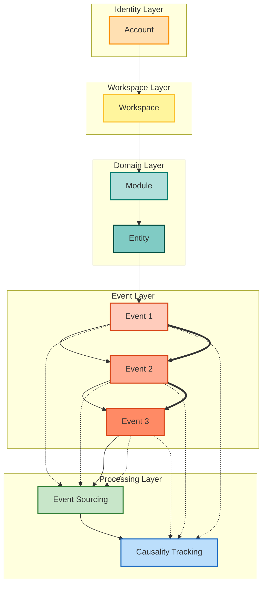
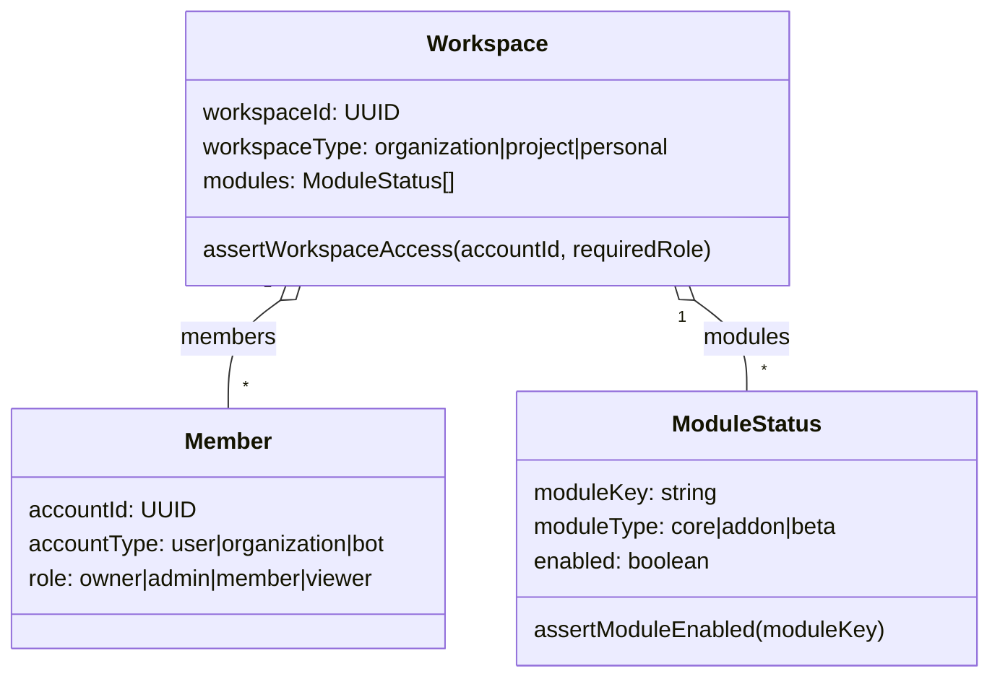
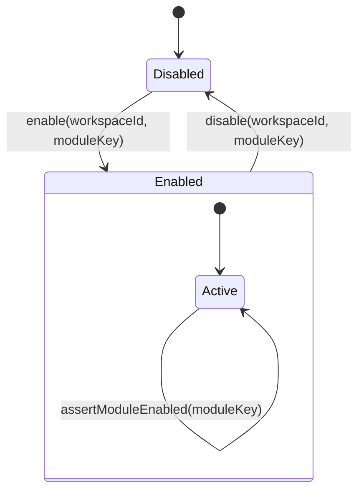

## Event Flow Overview


## Workspace Model & Permission APIs
- `workspaceId` 與 `workspaceType`：`organization | project | personal`
- 成員角色：`owner | admin | member | viewer`，用於權限界定。
- 可用模組列表需記錄 `moduleKey`、啟用狀態、模組類型。
- 權限檢查 API：`assertWorkspaceAccess(accountId, workspaceId, requiredRole)`、`assertModuleEnabled(workspaceId, moduleKey)`。



## Account Context & Authentication Flow
- `accountId` + `accountType (user | organization | bot)` 定義 Actor。
- Actor 與 Workspace 需透過 membership 連結；登入後可檢查所屬 Workspace 權限。
- 登入/驗證流程需串接 Workspace / Module 的權限檢查。

```mermaid
sequenceDiagram
    participant Actor as Actor(accountId/accountType)
    participant Auth as AuthService
    participant WS as Workspace
    participant Mod as Module

    Actor->>Auth: signIn(credentials)
    Auth->>WS: lookupMembership(accountId, workspaceId)
    WS-->>Auth: assertWorkspaceAccess()
    Auth->>Mod: assertModuleEnabled(moduleKey)
    Mod-->>Auth: module enabled/disabled
    Auth-->>Actor: session/accessToken
```

## Module Lifecycle & Enablement
- 每個模組記錄 `moduleKey`、`moduleType` 與所屬 Workspace。
- 模組狀態：啟用 / 停用；需透過 `assertModuleEnabled()` 進行權限檢查。
- 啟用/停用應保留審計事件以供後續追蹤。



// END OF FILE
