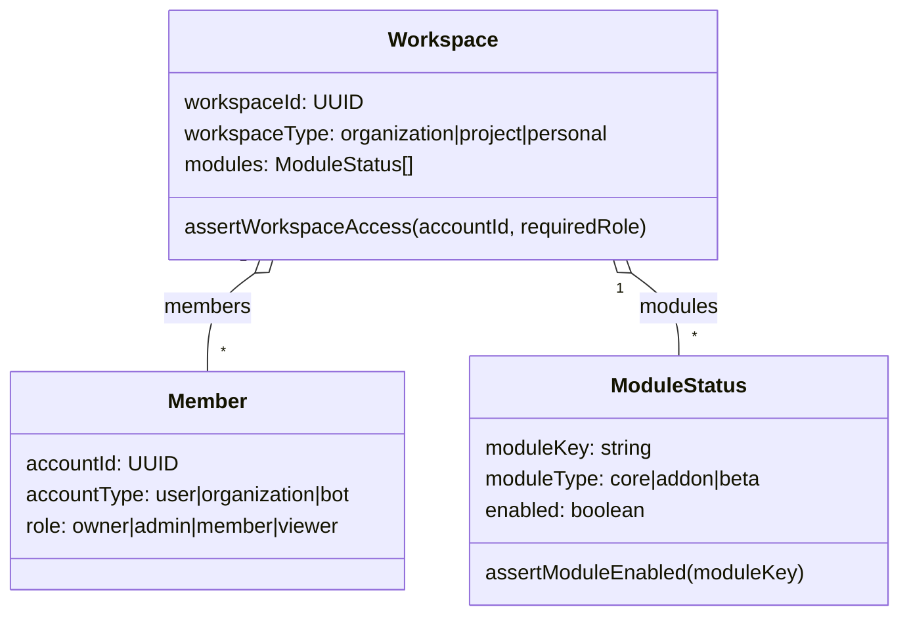
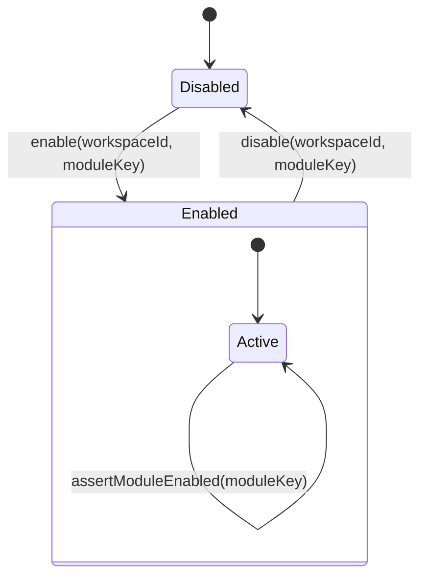

## Event Flow Overview
```mermaid
flowchart TD
    subgraph Identity["Identity Layer"]
        A1[User]
        A2[Organization]
        A3[Bot]
    end
    subgraph WorkspaceLayer["Workspace Layer"]
        B[Workspace\ntype: org|project|personal]
        M1[Members\nroles: owner/admin/member/viewer]
        M2[Modules\nmoduleKey/type/enabled]
    end
    subgraph Domain["Domain Layer"]
        C[Module]
        D[Entity]
    end
    subgraph EventLayer["Event Layer"]
        E1[Event 1]
        E2[Event 2]
        E3[Event 3]
    end
    subgraph Processing["Processing Layer"]
        F[Event Sourcing]
        G[Causality Tracking]
    end
    A1 --> B
    A2 --> B
    A3 --> B
    B --> M1
    B --> M2
    B --> C --> D --> E1 --> E2 --> E3 --> F --> G
    E1 -.-> F
    E2 -.-> F
    E3 -.-> F
    E1 -.-> G
    E2 -.-> G
    E3 -.-> G
    E1 ==> E2
    E2 ==> E3
    classDef note fill:#eef5ff,stroke:#4c6fff,stroke-width:1px,color:#1a2b5f;
    NF["Event note: DomainEvent<T> carries workspaceId, moduleKey, actorId, causedBy/traceId, timestamp, payload"]:::note
    NF -.-> E1
```

## Workspace / Account / Module Core
- Workspace=容器；Organization=Workspace；User/Bot=Actor (`workspaceType`: organization|project|personal).
- `accountType`: user|bot|organization；Actor ≠ Workspace，ACL 分層。
- 成員角色：owner|admin|member|viewer；模組列表含 moduleKey/moduleType/enabled。
- ACL：`assertWorkspaceAccess(accountId, workspaceId, requiredRole)`、`assertModuleEnabled(workspaceId, moduleKey)`；Entity 只記錄狀態。



## Auth Chain & Session (Angular)
- 登入鏈：`@angular/fire/auth → @delon/auth → DA_SERVICE_TOKEN → @delon/acl`。
- 多 Workspace：登入後列 memberships → 選 Workspace → 進入 Module/Entity；所有事件綁 `workspaceId`。

```mermaid
sequenceDiagram
    participant Actor as Actor(accountId/accountType)
    participant Auth as AuthService
    participant WS as Workspace
    participant Mod as Module
    Actor->>Auth: signIn(credentials)
    Auth->>WS: lookupMembership(accountId, workspaceId)
    WS-->>Auth: assertWorkspaceAccess()
    Auth->>Mod: assertModuleEnabled(moduleKey)
    Mod-->>Auth: enabled/disabled
    Auth-->>Actor: session (Workspace scoped)
```

## Module Boundary & Permissions
- Module = 功能邊界；先 `assertModuleEnabled()` 再操作 Entity。
- Entity = 資料單位；不處理 ACL，只記錄狀態與事件。



## Event Sourcing & Causality
- Event 型態：`eventType, aggregateId, workspaceId, payload, metadata{actorId, causedBy, traceId, timestamp, moduleKey}`。
- 重播前驗證 Workspace/Module 啟用；Event 對應 Entity 變更，因果鏈靠 `causedBy/traceId`。

## Divergence Watchlist
1) Workspace=Organization；Actor 不是 Workspace。
2) AccountType：User/Bot=Actor；Organization=Workspace。
3) Module 控功能，Entity 控資料，ACL 在 Workspace/Module。
4) Event 對應 Entity 變更；因果以 `causedBy/traceId` 追蹤。
5) 多 Workspace：Session 必選 Workspace，事件/資料綁 `workspaceId`。

// END OF FILE
