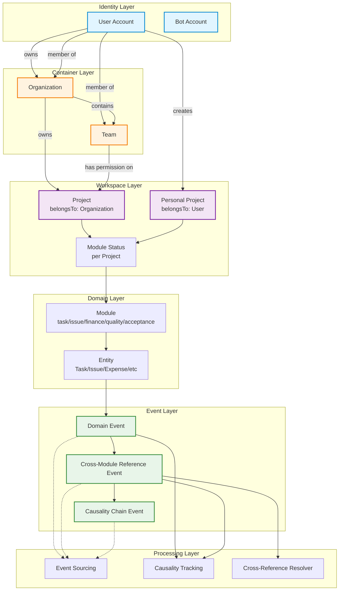
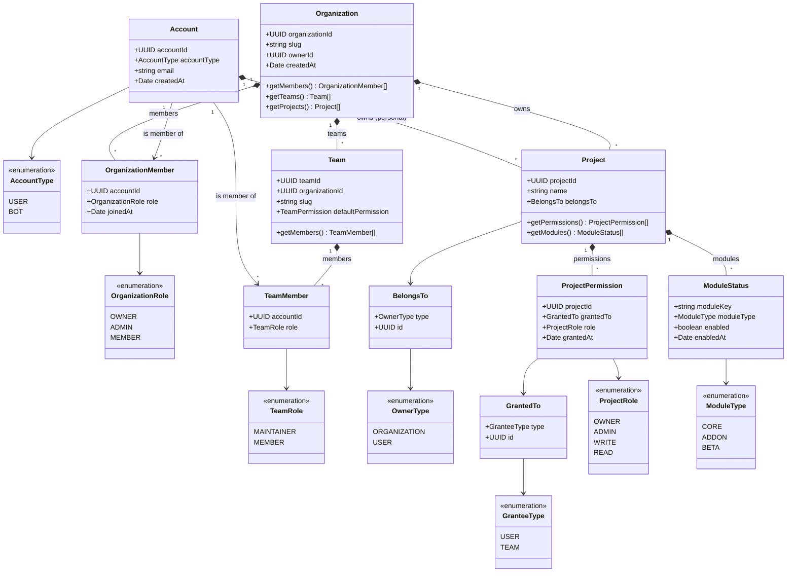
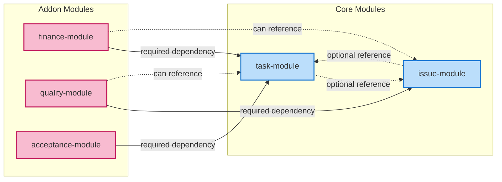
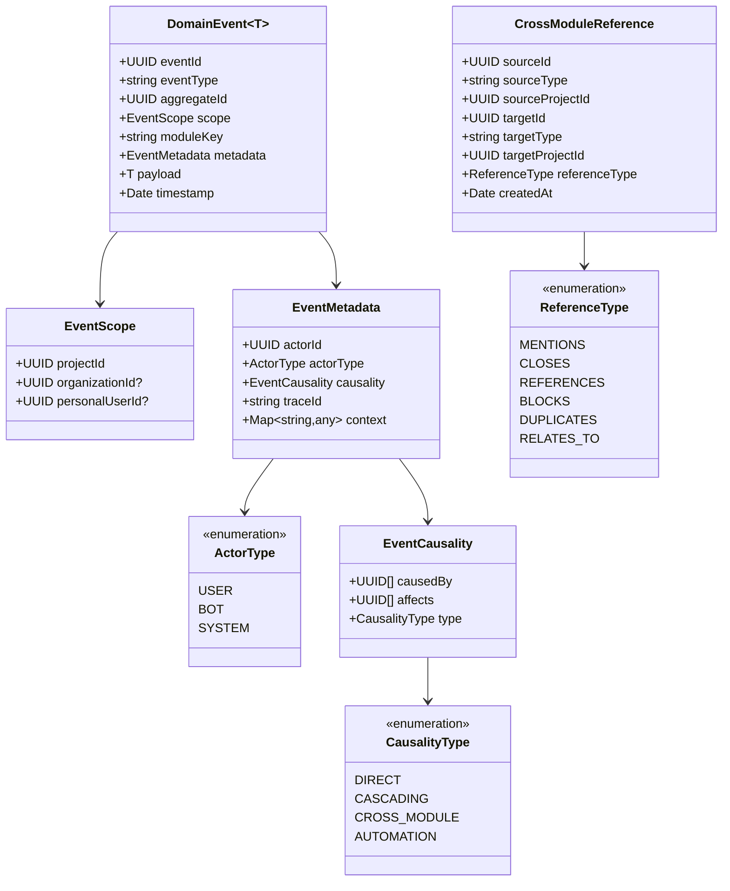
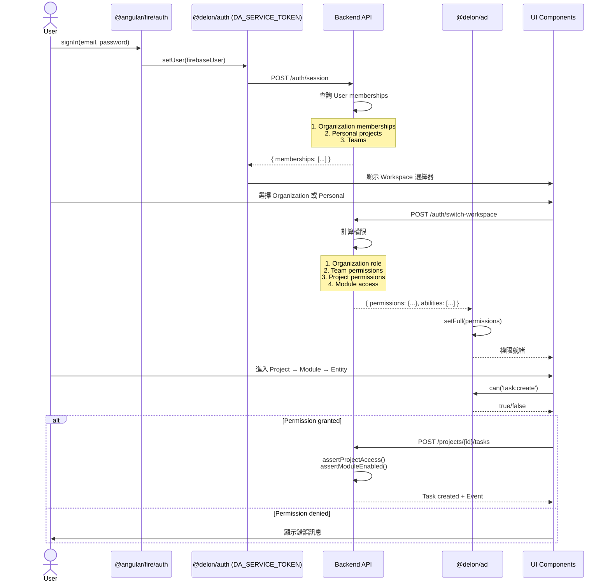
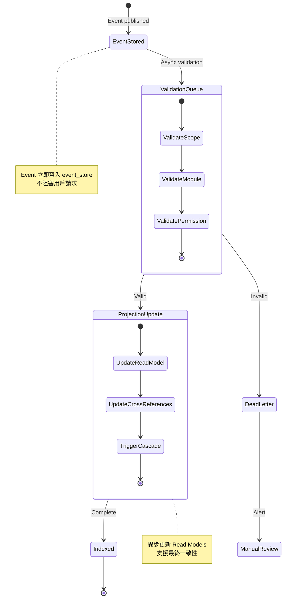
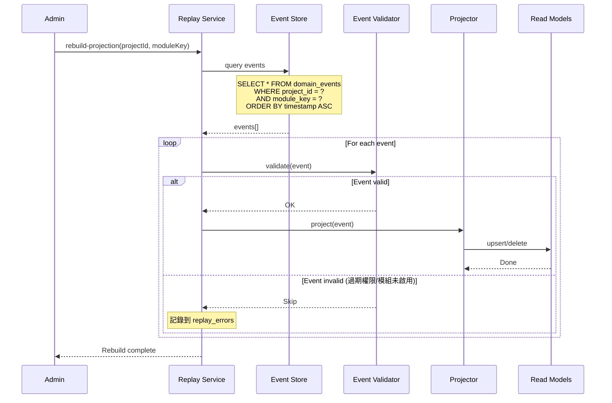
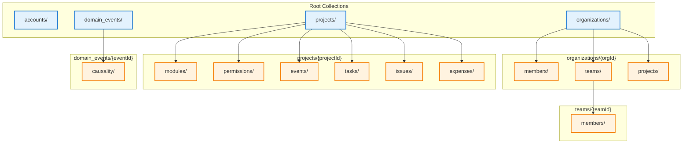
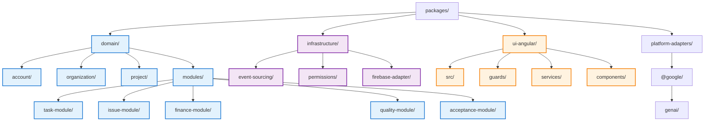

<!-- 用途：通用架構與事件流程的 Mermaid 圖示（基礎版本）。 -->

# Project Architecture Design

## Core Concepts

### Identity vs Workspace Separation
- **Account** = 登入主體 (User, Bot)
- **Organization** = 實體容器 (擁有 Teams 和 Projects)
- **Workspace** = 邏輯容器 (Project 或 Personal Space)
- **Actor** = 操作執行者 (必定是 User 或 Bot，永遠不是 Organization)

### Key Principles
1. Organization 是資源擁有者，但不是 Actor
2. User 代表 Organization 執行操作
3. Project 繼承 Organization/Team 的權限
4. Event 必須記錄完整的層級關係 (Organization → Project → Module → Entity)

---

## Event Flow Overview



---

## Account, Organization, Project Relationships



---

## Permission Inheritance Chain

```mermaid
flowchart TD
    subgraph Check["Permission Check Flow"]
        START[User requests action on Entity]
        
        CHECK_PERSONAL{Is Personal\nProject?}
        CHECK_OWNER_PERSONAL{Is Project\nOwner?}
        
        CHECK_ORG{Belongs to\nOrganization?}
        CHECK_ORG_MEMBER{Is Org\nMember?}
        CHECK_ORG_ROLE{Has sufficient\nOrg role?}
        
        CHECK_TEAM{Has Team\nPermission?}
        CHECK_TEAM_ROLE{Team role\n>= required?}
        
        CHECK_DIRECT{Has Direct\nProject Permission?}
        CHECK_PROJECT_ROLE{Project role\n>= required?}
        
        CHECK_MODULE{Is Module\nEnabled?}
        
        ALLOW[✅ Allow]
        DENY[❌ Deny]
    END
    
    START --> CHECK_PERSONAL
    
    CHECK_PERSONAL -->|Yes| CHECK_OWNER_PERSONAL
    CHECK_OWNER_PERSONAL -->|Yes| CHECK_MODULE
    CHECK_OWNER_PERSONAL -->|No| DENY
    
    CHECK_PERSONAL -->|No| CHECK_ORG
    CHECK_ORG -->|Yes| CHECK_ORG_MEMBER
    CHECK_ORG_MEMBER -->|No| DENY
    CHECK_ORG_MEMBER -->|Yes| CHECK_ORG_ROLE
    
    CHECK_ORG_ROLE -->|Owner/Admin| CHECK_MODULE
    CHECK_ORG_ROLE -->|Member| CHECK_TEAM
    
    CHECK_TEAM -->|Yes| CHECK_TEAM_ROLE
    CHECK_TEAM -->|No| CHECK_DIRECT
    
    CHECK_TEAM_ROLE -->|Sufficient| CHECK_MODULE
    CHECK_TEAM_ROLE -->|Insufficient| CHECK_DIRECT
    
    CHECK_DIRECT -->|Yes| CHECK_PROJECT_ROLE
    CHECK_DIRECT -->|No| DENY
    
    CHECK_PROJECT_ROLE -->|Sufficient| CHECK_MODULE
    CHECK_PROJECT_ROLE -->|Insufficient| DENY
    
    CHECK_MODULE -->|Enabled| ALLOW
    CHECK_MODULE -->|Disabled| DENY
    
    classDef allow fill:#c8e6c9,stroke:#388e3c,stroke-width:2px
    classDef deny fill:#ffcdd2,stroke:#c62828,stroke-width:2px
    
    class ALLOW allow
    class DENY deny
```

---

## Module Dependencies & Cross-References



### Module Dependency Definition

```typescript
interface ModuleDefinition {
  moduleKey: string;
  moduleType: 'core' | 'addon' | 'beta';
  dependencies: {
    required: string[];    // 必須啟用的模組
    optional: string[];    // 可選功能增強
  };
  crossModuleReferences: {
    [entityType: string]: {
      targetModule: string;
      relationshipType: 'owns' | 'references' | 'depends';
      onTargetDelete: 'cascade' | 'nullify' | 'prevent';
    };
  };
}

// Example: finance-module
{
  moduleKey: 'finance-module',
  moduleType: 'addon',
  dependencies: {
    required: ['task-module'],
    optional: ['issue-module']
  },
  crossModuleReferences: {
    'expense.taskId': {
      targetModule: 'task-module',
      relationshipType: 'depends',
      onTargetDelete: 'cascade'  // Task 刪除 → Expense 級聯刪除
    },
    'expense.relatedIssueId': {
      targetModule: 'issue-module',
      relationshipType: 'references',
      onTargetDelete: 'nullify'  // Issue 刪除 → 清空引用
    }
  }
}
```

---

## Domain Event Structure



### Event Example

```typescript
// Example 1: Task created in organization project
{
  eventId: "evt_abc123",
  eventType: "task.created",
  aggregateId: "task_xyz789",
  scope: {
    projectId: "proj_456",
    organizationId: "org_123",  // ✅ 支援組織層級查詢
    personalUserId: null
  },
  moduleKey: "task-module",
  metadata: {
    actorId: "user_alice",
    actorType: "USER",
    causality: {
      causedBy: [],  // 無前置因果
      affects: [],   // 初始事件
      type: "DIRECT"
    },
    traceId: "trace_abc",
    context: {
      organizationSlug: "my-org",
      projectSlug: "my-project"
    }
  },
  payload: {
    title: "Implement login feature",
    assigneeId: "user_bob"
  },
  timestamp: "2026-01-08T10:30:00Z"
}

// Example 2: Issue references task (cross-module)
{
  eventId: "evt_def456",
  eventType: "issue.referenced",
  aggregateId: "issue_111",
  scope: {
    projectId: "proj_456",
    organizationId: "org_123",
    personalUserId: null
  },
  moduleKey: "issue-module",
  metadata: {
    actorId: "user_bob",
    actorType: "USER",
    causality: {
      causedBy: ["evt_abc123"],  // ✅ 由 Task 建立觸發
      affects: ["task_xyz789"],  // ✅ 影響 Task
      type: "CROSS_MODULE"
    },
    traceId: "trace_abc",
    context: {
      referenceType: "RELATES_TO",
      commentId: "comment_999"
    }
  },
  payload: {
    targetTaskId: "task_xyz789",
    targetProjectId: "proj_456",
    referenceText: "Relates to #123"
  },
  timestamp: "2026-01-08T10:35:00Z"
}

// Example 3: Expense created for task (addon module)
{
  eventId: "evt_ghi789",
  eventType: "expense.created",
  aggregateId: "expense_222",
  scope: {
    projectId: "proj_456",
    organizationId: "org_123",
    personalUserId: null
  },
  moduleKey: "finance-module",
  metadata: {
    actorId: "user_alice",
    actorType: "USER",
    causality: {
      causedBy: ["evt_abc123"],  // Task 存在是前提
      affects: ["task_xyz789"],  // 影響 Task 的財務資訊
      type: "CASCADING"
    },
    traceId: "trace_def",
    context: {
      currency: "USD"
    }
  },
  payload: {
    taskId: "task_xyz789",
    amount: 1500.00,
    description: "Development cost"
  },
  timestamp: "2026-01-08T11:00:00Z"
}
```

---

## Auth Chain & Session (Angular)



### Angular Permission Service Implementation

```typescript
// services/project-permission.service.ts
interface SessionPermissionCache {
  projectId: string;
  organizationId?: string;
  
  // ✅ 預先計算的權限
  computed: {
    'task:create': boolean;
    'task:edit:own': boolean;
    'task:edit:any': boolean;
    'task:delete': boolean;
    'issue:create': boolean;
    'issue:close': boolean;
    'issue:assign': boolean;
    'finance:view': boolean;
    'finance:create': boolean;
    // ... 所有可能的操作
  };
  
  // ✅ 實體層級的快取
  entities: {
    [entityId: string]: {
      edit: boolean;
      delete: boolean;
      assign: boolean;
    };
  };
  
  expiresAt: Date;
}

@Injectable({ providedIn: 'root' })
export class ProjectPermissionService {
  private cache = signal<SessionPermissionCache | null>(null);
  
  constructor(
    private http: HttpClient,
    private aclService: ACLService,
    @Inject(DA_SERVICE_TOKEN) private tokenService: ITokenService
  ) {}
  
  async switchProject(projectId: string): Promise<void> {
    // ✅ 一次性載入所有權限
    const permissions = await firstValueFrom(
      this.http.get<SessionPermissionCache>(
        `/api/projects/${projectId}/permissions`
      )
    );
    
    this.cache.set(permissions);
    
    // ✅ 更新 @delon/acl
    this.aclService.setFull({
      role: permissions.computed,
      ability: Object.keys(permissions.computed).filter(
        key => permissions.computed[key]
      )
    });
  }
  
  can(action: string): boolean {
    return this.cache()?.computed[action] ?? false;
  }
  
  canEditEntity(entityId: string): boolean {
    return this.cache()?.entities[entityId]?.edit ?? false;
  }
  
  canDeleteEntity(entityId: string): boolean {
    return this.cache()?.entities[entityId]?.delete ?? false;
  }
}
```

---

## Event Sourcing & Replay Strategy



### Event Replay Process



---

## Firestore Schema Design (Firebase)

### Root Collections & Subcollections
- **accounts/{accountId}**：帳號主檔，反正規化組織/團隊/專案權限快取，支援快速查詢登入者可見的 Workspace。
- **organizations/{orgId}**：組織主檔，子集合 `members/`、`teams/`、`projects/`。`members/{accountId}` 內嵌 email/displayName 以減少往返。
- **teams/{teamId}**：子集合 `members/`，並冗餘 `organizationId` 以利 Collection Group Query。
- **projects/{projectId}**：子集合 `modules/`、`permissions/`、`events/`、`tasks/`、`issues/`、`expenses/`，每個文件冗餘 `organizationId`/`projectId` 以利跨集合查詢。
- **domain_events/{eventId}/causality/**：全域事件存檔，子集合紀錄 causedBy/affects 以支援因果追蹤與重播。



### Event Store in Firestore
- 使用 `domain_events/{eventId}` 作為 append-only 儲存，metadata 內含 `workspaceId/projectId/organizationId/moduleKey/actorId/causedBy/traceId`。
- 重播時以 `collectionGroup('events')` 查詢專案範圍事件，或用 Cloud Functions/Batch 處理 offline projector。
- 需要大量寫入時以 Batched Writes / BulkWriter，單批 <= 500 筆並控制速率；跨批次以 traceId 分段保證順序。

### Security Rules 重點
- 所有讀寫以 `request.auth.uid` + `customClaims` 驗證組織/專案角色。
- `projects/{projectId}/modules/{moduleKey}` 需先檢查啟用狀態才能讀寫子集合。
- domain_events 僅後端服務寫入：以 Callable Function 或 Admin SDK，前端只讀 projection。

## Critical Validation Rules

### 1. Project Creation Validation

```typescript
async function createProject(
  actorId: UUID,
  data: CreateProjectDTO
): Promise<Project> {
  
  // ✅ Case 1: Personal project
  if (data.belongsTo.type === 'user') {
    if (data.belongsTo.id !== actorId) {
      throw new ForbiddenError('只能建立自己的個人專案');
    }
  }
  
  // ✅ Case 2: Organization project
  if (data.belongsTo.type === 'organization') {
    const membership = await getOrganizationMembership(
      actorId,
      data.belongsTo.id
    );
    
    if (!membership) {
      throw new ForbiddenError('不是組織成員');
    }
    
    if (!['owner', 'admin'].includes(membership.role)) {
      throw new ForbiddenError('需要 owner 或 admin 權限');
    }
  }
  
  // Create project and emit event
  const project = await db.projects.create(data);
  
  await emitEvent({
    eventType: 'project.created',
    aggregateId: project.projectId,
    scope: {
      projectId: project.projectId,
      organizationId: data.belongsTo.type === 'organization' 
        ? data.belongsTo.id 
        : null,
      personalUserId: data.belongsTo.type === 'user' 
        ? data.belongsTo.id 
        : null
    },
    moduleKey: null,
    metadata: {
      actorId,
      actorType: 'user',
      causality: { causedBy: [], affects: [], type: 'direct' },
      traceId: generateTraceId(),
      context: {}
    },
    payload: data
  });
  
  return project;
}
```

### 2. Module Dependency Validation

```typescript
async function enableModule(
  projectId: UUID,
  moduleKey: string
): Promise<void> {
  
  const moduleDef = MODULE_REGISTRY.get(moduleKey);
  
  // ✅ 檢查必要依賴
  for (const requiredModule of moduleDef.dependencies.required) {
    const status = await db.moduleStatus.findOne({
      projectId,
      moduleKey: requiredModule
    });
    
    if (!status?.enabled) {
      throw new ValidationError(
        `必須先啟用 ${requiredModule}`
      );
    }
  }
  
  // Enable module
  await db.moduleStatus.upsert({
    projectId,
    moduleKey,
    enabled: true,
    enabledAt: new Date()
  });
}
```

### 3. Cross-Module Reference Validation

```typescript
async function createTaskIssueReference(
  actorId: UUID,
  taskId: UUID,
  issueId: UUID,
  referenceType: 'closes' | 'references'
): Promise<void> {
  
  const task = await db.tasks.findById(taskId);
  const issue = await db.issues.findById(issueId);
  
  // ✅ 檢查模組啟用
  const taskModuleEnabled = await isModuleEnabled(
    task.projectId,
    'task-module'
  );
  const issueModuleEnabled = await isModuleEnabled(
    issue.projectId,
    'issue-module'
  );
  
  if (!taskModuleEnabled || !issueModuleEnabled) {
    throw new ValidationError('相關模組未啟用');
  }
  
  // ✅ 檢查跨專案引用權限
  if (task.projectId !== issue.projectId) {
    const hasAccessToIssue = await hasProjectAccess(
      actorId,
      issue.projectId,
      'read'
    );
    
    if (!hasAccessToIssue) {
      throw new ForbiddenError('無權引用該 Issue');
    }
  }
  
  // Create reference
  await db.crossModuleReferences.create({
    sourceId: taskId,
    sourceType: 'task',
    sourceProjectId: task.projectId,
    targetId: issueId,
    targetType: 'issue',
    targetProjectId: issue.projectId,
    referenceType
  });
  
  // Emit event with causality
  await emitEvent({
    eventType: 'task.referenced_issue',
    aggregateId: taskId,
    scope: {
      projectId: task.projectId,
      organizationId: task.organizationId,
      personalUserId: null
    },
    moduleKey: 'task-module',
    metadata: {
      actorId,
      actorType: 'user',
      causality: {
        causedBy: [],
        affects: [issueId],  // ✅ 影響 Issue
        type: 'cross_module'
      },
      traceId: generateTraceId(),
      context: { referenceType }
    },
    payload: { targetIssueId: issueId }
  });
}
```

---

## Divergence Watchlist (Updated)

### ✅ Fixed Issues

1. **Identity Separation**
   - Account (User/Bot) = 登入主體
   - Organization ≠ Account，是資源容器
   - Actor 永遠是 Account，不是 Organization

2. **Three-Tier Permission Model**
   - Organization Member → Team → Project Permission
   - 支援權限繼承與覆寫

3. **Event Scope Hierarchy**
   - Event 包含 `{ projectId, organizationId?, personalUserId? }`
   - 支援組織層級查詢與報表

4. **Module Dependency Management**
   - 模組註冊時聲明依賴
   - 啟用前驗證依賴鏈

5. **Cross-Module Causality**
   - `causedBy: UUID[]` 支援多因果
   - `affects: UUID[]` 明確影響範圍
   - Cross-reference 表記錄跨模組關聯

### ⚠️ Implementation Notes

1. **Angular Frontend Caching**
   - 專案切換時一次性載入所有權限
   - 使用 Signal 管理權限快取
   - 避免過度的 ACL 檢查

2. **Event Replay Strategy**
   - 支援按 Project + Module 重建 Read Model
   - 驗證過期事件（模組已停用、權限已變更）
   - Dead Letter Queue 處理異常事件

3. **Performance Optimization**
   - `domain_events` 表需要分區 (partition by project_id)
   - 組織層級查詢使用 Materialized View
   - 跨專案引用建立專用索引

---

## Packages Directory Tree (Updated)



---

## Summary of Key Changes

### 🔧 Architectural Fixes

1. **分離 Organization 與 Account**
   - Organization 是容器，不是登入主體
   - User 代表 Organization 執行操作

2. **三層權限模型**
   - Organization → Team → Project
   - 支援 GitHub-style 的團隊授權

3. **Event Scope 完整化**
   - 新增 `organizationId` 和 `personalUserId`
   - 支援組織層級的事件查詢

4. **Module 依賴系統**
   - 模組註冊時聲明依賴
   - 跨模組引用的生命週期管理

5. **多因果追蹤**
   - `causedBy: UUID[]` 支援多前置事件
   - `affects: UUID[]` 明確影響範圍

### 🎯 Implementation Priorities

**P0 (立即實作)**
1. Firestore 集合與規則建立
2. 權限計算 API (`/projects/{id}/permissions`)
3. Angular Permission Service

**P1 (短期規劃)**
4. Module Registry 與依賴驗證
5. Event Store 與基礎 Projector
6. Cross-Module Reference 表

**P2 (中期規劃)**
7. Event Replay 機制
8. Organization 層級報表
9. Team 管理 UI

---

// END OF FILE