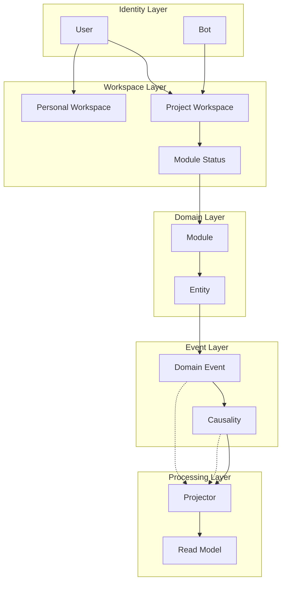

<!-- 用途：描述 Firebase 導向的架構層與事件流 Mermaid 圖。 -->

## 架構層（Firebase 導向）
- 身分層（Account/User/Bot）與容器層（Organization/Team）分離；Workspace=Project 或 Personal Space，事件與資料都繫結 `workspaceId`。
- 模組層是功能邊界，Entity 只負責狀態；ACL 由 Workspace/Module 共同決定，先 `assertWorkspaceAccess`、再 `assertModuleEnabled`。
- 事件流：Actor → Workspace → Module/Entity → Domain Event → Event Store → Projector/Read Model，所有事件帶有 `moduleKey/actorId/causedBy/traceId`。

### 分層責任
- **Identity/Workspace**：管理成員與模組啟用狀態，Firebase Auth + custom claims 提供 workspace 範圍權限。
- **Domain/Module**：實作商業邏輯與事件定義，不直接處理 UI / Firebase SDK 細節。
- **Event Layer**：Cloud Functions 負責寫入 `domain_events`，Projector 重播事件更新 Read Models。
- **UI Layer**：Angular 透過 @angular/fire 取回 projection，路由守衛只檢查 workspace/module gating。
