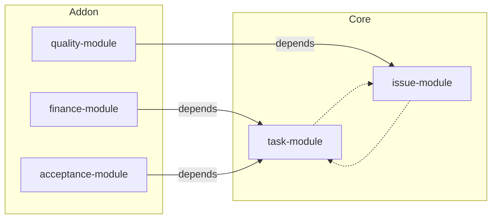

## 模組層

### 模組邊界
- Module 為功能封裝單元（task/issue/finance/quality/acceptance 等），在 Workspace 下註冊，狀態以 `modules/{moduleKey}` 表示。
- Entity 僅存狀態與事件，不負責 ACL；所有操作前先 `assertModuleEnabled`。
- Module 之間可定義依賴與引用關係，透過事件與投影管理生命週期。

### 依賴與引用策略
- `dependencies.required`：未啟用時拒絕啟動；`optional`：存在時解鎖額外能力。
- Cross-module references（如 issue → task）：以 `cross_module_references` 集合儲存，`onTargetDelete` 決定 cascade/nullify/prevent。
- Projection 層統一維護關聯，避免前端直接寫入跨模組引用。
