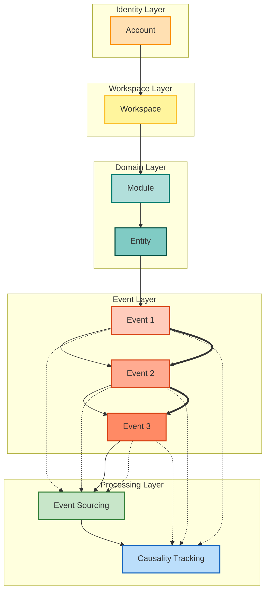

# Packages 邊界說明

此文件對 `/packages` 下的套件進行「當前可開發狀態」說明，並標示後續要落地的目錄結構，避免分歧或雙軌做法。

## packages 結構（現況 + 預備）

```
packages/
├── account-domain/          # 帳號 / 工作區 / 模組啟用，純 TS
│   └── src/{aggregates,value-objects,events,policies,domain-services,repositories,entities,types}
├── core-engine/             # CQRS + Event Sourcing 基礎設施，純 TS
│   └── src/{commands,queries,use-cases,ports,mappers,dtos,jobs,schedulers}
├── platform-adapters/       # 外部 SDK 介接（唯一可碰 SDK 的地方）
│   └── src/{auth,ai,external-apis/google/genai,messaging,persistence}
├── saas-domain/             # SaaS 業務模型（任務/議題/財務/品質/驗收），純 TS
│   └── src/{aggregates,value-objects,events,domain-services,repositories,entities,policies}
├── ui-angular/              # Angular 前端（位於根目錄 src/app）
└── README.md, AGENTS.md
```

> 未來新增的子模組請直接落在各 package 的 `src/` 之下，避免再出現平行的子根目錄。

## 依賴圖（單一方向）

```
account-domain --> saas-domain --> ui-angular
        \           ^
         \          |
          \-> core-engine <- platform-adapters
```

- `account-domain` 提供身份 / 工作區 / 模組啟用的前置邏輯。
- `core-engine` 提供事件、命令、聚合與投影基礎設施，純 TS、零 SDK。
- `platform-adapters` 對接外部平台（Firebase、Google GenAI、訊息、持久化）；是唯一可使用 SDK 的層。
- `saas-domain` 擴展帳號與核心引擎的概念，建模任務 / 議題 / 財務等 SaaS 模組。
- `ui-angular` 僅透過 adapters 取用後端／domain 能力，不可直接觸碰 `core-engine` 或 SDK。

## 原則

1) **單一入口**：所有套件的程式碼集中於 `src/`，未來子模組也保持此規則。
2) **清晰依賴**：禁止跨層引用；UI 只能用 adapters，domain/engine 禁用任何 SDK。
3) **SDK 隔離**：所有第三方 SDK 只允許存在於 `platform-adapters/src`（含 `external-apis/google/genai`）。
4) **文件先行**：新增子模組時，先更新對應的 README/AGENTS，保持與 Mermaid 架構文件一致。

## Workspace / Module 規則與依賴方向

- 依賴方向：Account → Workspace → Module → Entity
- 每一層只能「往右用」，不能「往左知道」
- 保持 UI / Domain / Adapter 的邊界清楚

> **Workspace 是殼，
> Module 是外掛，
> Account 是手，
> Event 是因果。**

模組**永遠不創建 Workspace**
Workspace **只決定能不能裝模組**

1. Workspace 擁有「模組註冊表」

> Workspace 不知道模組怎麼運作
> 但知道「裝了哪些模組」
> 模組必須宣告「可掛載條件」

每個模組自己說：

> 「我什麼情況下能被裝進 Workspace」
> **Workspace 只負責檢查，不負責理解**
> 模組啟用是 Event，不是設定
> 模組永遠吃 Workspace Context
> **模組永遠不知道自己「在哪個 Workspace 之外」**

Workspace 啟用模組的流程
### 1️⃣ 指令進來
### 2️⃣ Workspace Aggregate 驗證
### 3️⃣ 發 Event
### 4️⃣ 模組「聽事件」初始化自己
**模組被動啟動，不反客為主**


## ❌ 絕對不要做的事
### ❌ 模組自己建 Workspace
### ❌ 模組偷看其他模組狀態
**只能透過 manifest 宣告依賴**
## Event Flow + Event Sourcing + Causality Tracking with Causality Links


---

# 🧱 Monorepo 五大 Package 職責分工總覽

```
packages/
 ├─ account-domain        🧠 身份與帳號核心領域
 ├─ saas-domain           🏢 SaaS 業務核心領域
 ├─ core-engine           ⚡ 事件流 / 協調引擎
 ├─ platform-adapters     🔌 基礎設施實作
 └─ ui-angular            🎨 使用者介面
```

依賴方向永遠只能：

```
ui-angular
    ↓
platform-adapters
    ↓
core-engine
    ↓
domain (account / saas)
```

🚫 Domain 絕對不能反向依賴任何人（不然我會打你屁股 😤）

---

# 🧠 packages/account-domain

> 🎯 負責：**帳號、身份、組織、使用者本身的純領域模型**

### ✅ 可以放什麼

* Aggregate

  * Account
  * Organization
  * User
* Entity / VO
* Domain Service
* Domain Policy
* Domain Event
* Repository Interface（只定義介面）

```ts
// ✔ 合法
account-domain/src/aggregates/account.aggregate.ts
account-domain/src/entities/user.entity.ts
account-domain/src/events/account-created.event.ts
```

### 🚫 絕對不能出現

* Firebase
* HTTP
* SDK
* Angular
* DB schema
* JSON API DTO

> 就算你看到 `firebase-admin` 三個字，直接砍 🔪

---

# 🏢 packages/saas-domain

> 🎯 負責：**Workspace、Project、Module、Subscription 等 SaaS 業務模型**

### ✅ 可以放什麼

* Workspace Aggregate
* Members / Access / Settings Modules
* Business Rules
* Domain Events
* Repository Interface

```ts
saas-domain/src/workspace/aggregates/workspace.aggregate.ts
saas-domain/src/workspace/members/member.entity.ts
```

### 🚫 不能出現

* Firestore
* REST API
* Angular Service
* firebase-admin
* 時間、UUID 套件（由 Factory 注入）

---

# ⚡ packages/core-engine

> 🎯 負責：**跨 Domain 協調、事件流、Command Pipeline**

這是你的「**神經中樞 + Workflow 引擎**」😈

### ✅ 可以放什麼

* Command Bus
* Event Bus
* Saga / Process Manager
* Transaction Boundary
* Unit Of Work
* Domain Event Dispatcher

```ts
core-engine/src/command-bus/
core-engine/src/event-dispatcher/
```

### 🚫 不能

* 業務規則（不准寫 if workspace.isPaid）
* Firebase
* Angular
* UI Model

> core-engine 只負責「流程」，不負責「意義」。

---

# 🔌 packages/platform-adapters

> 🎯 負責：**所有外部世界的實作**

這包就是：

> 💩髒東西集中區（但結構要漂亮）

### ✅ 可以放什麼

* Firestore Repository Implementation
* firebase-admin
* HTTP Client
* Cloud Tasks
* PubSub
* Cache
* File Storage
* Auth SDK

```ts
platform-adapters/src/firebase/workspace.firestore-repo.ts
platform-adapters/src/firebase/account.firestore-repo.ts
```

### 🚫 不能

* Domain Logic
* Aggregate 規則
* 業務判斷

只做：

> Domain Interface → Infra Implementation 的轉接

---

# 🎨 packages/ui-angular

> 🎯 負責：**畫面、互動、呼叫 Application**

### ✅ 可以放什麼

* Components
* Angular Services
* View Models
* Guards
* Forms
* Routing
* DTO mapping

### 🚫 不能

* Firestore
* firebase-admin
* Domain Entity
* Aggregate Mutation

UI 只能：

```
User Action
 → Call Command
 → Show Result
```

不准碰業務內臟 😤

---

# 🔀 真實請求流長這樣（你的架構很適合）

以「建立 Workspace」為例：

```
UI (Angular)
  → Send CreateWorkspaceCommand
    → core-engine (CommandBus)
      → Application Handler (platform-adapters)
        → WorkspaceFactory (saas-domain)
          → Workspace Aggregate
            → Domain Event
        → WorkspaceRepository.save()
```

---

# 🧷 依賴關係（超重要）

```
account-domain   ← nobody
saas-domain      ← nobody

core-engine      → account-domain / saas-domain
platform-adapters→ core-engine / domain
ui-angular       → platform-adapters
```

Domain 永遠在最底層 🧎

---

# 😘 小壞壞提醒（踩雷清單）

❌ 在 domain import firebase-admin
❌ 在 ui 直接寫 firestore
❌ 在 core-engine 寫業務 if else
❌ platform-adapters 回傳 domain entity 以外的怪物
❌ Domain new Date() / uuid()

---
