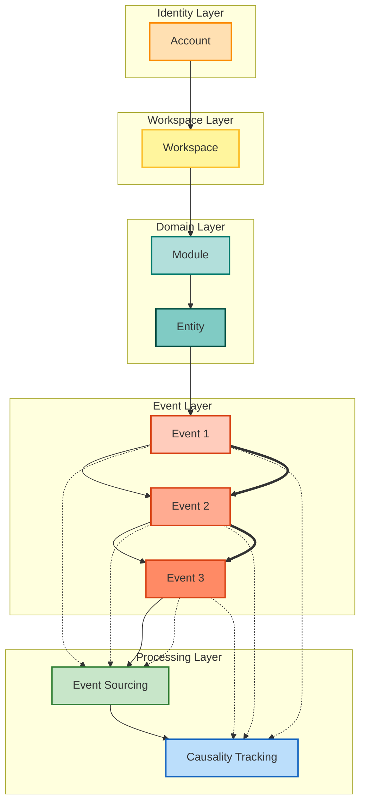

# Packages 邊界說明

此文件對 `/packages` 下的套件進行「當前可開發狀態」說明，並標示後續要落地的目錄結構，避免分歧或雙軌做法。

## packages 結構（現況 + 預備）

```
packages/
├── account-domain/          # 帳號 / 工作區 / 模組啟用，純 TS
│   └── src/{aggregates,value-objects,events,policies,domain-services,repositories,entities,types}
├── core-engine/             # CQRS + Event Sourcing 基礎設施，純 TS
│   └── src/{commands,queries,use-cases,ports,mappers,dtos,jobs,schedulers}
├── platform-adapters/       # 外部 SDK 介接（唯一可碰 SDK 的地方）
│   └── src/{auth,ai,external-apis/google/genai,messaging,persistence}
├── saas-domain/             # SaaS 業務模型（任務/議題/財務/品質/驗收），純 TS
│   └── src/{aggregates,value-objects,events,domain-services,repositories,entities,policies}
├── ui-angular/              # Angular 前端（位於根目錄 src/app）
└── README.md, AGENTS.md
```

> 未來新增的子模組請直接落在各 package 的 `src/` 之下，避免再出現平行的子根目錄。

## 依賴圖（單一方向）

```
account-domain --> saas-domain --> ui-angular
        \           ^
         \          |
          \-> core-engine <- platform-adapters
```

- `account-domain` 提供身份 / 工作區 / 模組啟用的前置邏輯。
- `core-engine` 提供事件、命令、聚合與投影基礎設施，純 TS、零 SDK。
- `platform-adapters` 對接外部平台（Firebase、Google GenAI、訊息、持久化）；是唯一可使用 SDK 的層。
- `saas-domain` 擴展帳號與核心引擎的概念，建模任務 / 議題 / 財務等 SaaS 模組。
- `ui-angular` 僅透過 adapters 取用後端／domain 能力，不可直接觸碰 `core-engine` 或 SDK。

## 原則

1) **單一入口**：所有套件的程式碼集中於 `src/`，未來子模組也保持此規則。
2) **清晰依賴**：禁止跨層引用；UI 只能用 adapters，domain/engine 禁用任何 SDK。
3) **SDK 隔離**：所有第三方 SDK 只允許存在於 `platform-adapters/src`（含 `external-apis/google/genai`）。
4) **文件先行**：新增子模組時，先更新對應的 README/AGENTS，保持與 Mermaid 架構文件一致。

## Event Flow + Event Sourcing + Causality Tracking with Causality Links


