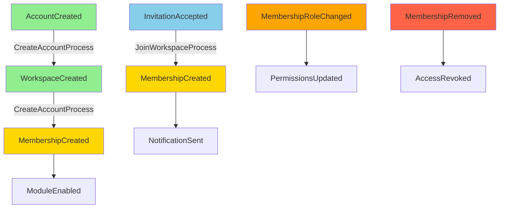

# account-domain AGENTS.md

> **AI Code Generation Guidelines for Identity & Account Domain**

## Mission

守護身份 / 工作區 / 模組啟用的前置條件。此 package 必須保持純 TypeScript，禁止依賴任何外部 SDK 或框架。

## Guardrails

### ✅ ALLOWED

- Pure TypeScript (ES2022+)
- Domain-Driven Design patterns (Aggregates, Entities, Value Objects)
- Domain Events and Event Sourcing patterns
- Repository interfaces (no implementations)
- Domain Services (stateless business logic)
- Policy objects for cross-aggregate rules

### ❌ FORBIDDEN

- **Any SDK**: Firebase, Angular, HTTP clients, database drivers
- **Framework decorators**: `@Injectable`, `@Component`, etc.
- **External dependencies**:除 TypeScript stdlib 外的任何 npm package
- **Non-deterministic operations**: `new Date()`, `Math.random()`, `crypto.randomUUID()`
- **Infrastructure concerns**: Logging, persistence, messaging, caching

## Current + Planned Structure

```
account-domain/
└── src/
    ├── aggregates/        # Account / Workspace / ModuleRegistry 聚合
    │   ├── account.aggregate.ts
    │   ├── workspace.aggregate.ts
    │   ├── organization.aggregate.ts (planned)
    │   └── module-registry.ts
    │
    ├── value-objects/     # 角色、模組型別、工作區型別
    │   ├── email.vo.ts
    │   ├── role.vo.ts
    │   ├── module-type.vo.ts
    │   └── workspace-type.vo.ts
    │
    ├── events/            # DomainEvent 介面與 metadata 工具
    │   ├── domain-event.interface.ts
    │   ├── account-created.event.ts
    │   ├── workspace-created.event.ts
    │   ├── module-enabled.event.ts
    │   └── membership-changed.event.ts
    │
    ├── policies/          # 跨聚合守則（如模組啟用檢查）
    │   ├── module-dependency.policy.ts
    │   └── workspace-creation.policy.ts
    │
    ├── domain-services/   # 無狀態的領域服務
    │   ├── workspace-creation.service.ts
    │   └── module-enablement.service.ts
    │
    ├── repositories/      # 介面定義（實作在 platform-adapters）
    │   ├── account.repository.ts
    │   ├── workspace.repository.ts
    │   └── membership.repository.ts
    │
    ├── entities/          # Entity 基礎型別
    │   ├── entity.base.ts
    │   ├── aggregate-root.base.ts
    │   └── membership.entity.ts
    │
    ├── types/             # 共用識別符
    │   ├── account-id.ts
    │   ├── workspace-id.ts
    │   └── user-id.ts
    │
    └── __tests__/         # 聚合 / VO 測試（新增實作時補齊）
        ├── account.aggregate.spec.ts
        ├── workspace.aggregate.spec.ts
        └── email.vo.spec.ts
```

> 未來新增的 membership / invitation / policy 請直接放在 `src/` 對應子資料夾，避免再次出現平行根目錄。

## Saga Flow Diagram



## Code Generation Rules

### 1. Aggregate Pattern

When generating an aggregate:

```typescript
// ✅ CORRECT Pattern
export class Account extends AggregateRoot {
  // Private constructor for invariant protection
  private constructor(
    public readonly id: AccountId,
    public readonly email: Email,
    private status: AccountStatus,
    public readonly createdAt: string
  ) {
    super();
  }

  // Factory method for creation
  static create(id: AccountId, email: Email, createdAt: string): Account {
    const account = new Account(id, email, AccountStatus.Active, createdAt);
    account.addDomainEvent(new AccountCreated(id, email, createdAt));
    return account;
  }

  // Reconstitution from persistence
  static reconstitute(
    id: AccountId,
    email: Email,
    status: AccountStatus,
    createdAt: string
  ): Account {
    return new Account(id, email, status, createdAt);
  }

  // Business method
  suspend(): void {
    if (this.status === AccountStatus.Suspended) {
      throw new DomainError('Account already suspended');
    }
    this.status = AccountStatus.Suspended;
    this.addDomainEvent(new AccountSuspended(this.id));
  }
}

// ❌ INCORRECT - Public constructor
export class Account {
  constructor(public id: string, public email: string) {} // NO!
}

// ❌ INCORRECT - Setter methods
export class Account {
  setStatus(status: string) { // NO! Use domain methods
    this.status = status;
  }
}

// ❌ INCORRECT - SDK usage
export class Account {
  async save() {
    await firestore.collection('accounts').add(this); // NO!
  }
}
```

### 2. Value Object Pattern

When generating a value object:

```typescript
// ✅ CORRECT Pattern
export class Email {
  // Private constructor
  private constructor(public readonly value: string) {
    this.validate();
  }

  // Named constructor
  static create(value: string): Email {
    return new Email(value);
  }

  private validate(): void {
    if (!value || !value.includes('@')) {
      throw new DomainError('Invalid email format');
    }
    // Add more validation rules
  }

  // Equality check
  equals(other: Email): boolean {
    return this.value === other.value;
  }

  // Conversion
  toString(): string {
    return this.value;
  }
}

// ❌ INCORRECT - Mutable value object
export class Email {
  constructor(public value: string) {} // NO! Should be readonly
  
  changeValue(newValue: string) { // NO! Value objects are immutable
    this.value = newValue;
  }
}

// ❌ INCORRECT - No validation
export class Email {
  constructor(public readonly value: string) {} // NO! Missing validation
}
```

### 3. Domain Event Pattern

When generating a domain event:

```typescript
// ✅ CORRECT Pattern
export class AccountCreated implements DomainEvent {
  public readonly eventId: string;
  public readonly eventType = 'AccountCreated';
  public readonly occurredAt: string;

  constructor(
    public readonly accountId: AccountId,
    public readonly email: Email,
    occurredAt: string,
    public readonly causationId?: string,
    public readonly correlationId?: string
  ) {
    this.eventId = crypto.randomUUID(); // OK in event, generated at event creation
    this.occurredAt = occurredAt;
  }

  get aggregateId(): string {
    return this.accountId.value;
  }
}

// ❌ INCORRECT - Mutable event
export class AccountCreated {
  public eventId: string; // NO! Should be readonly
  public accountId: string; // NO! Should use typed ID
  
  setAccountId(id: string) { // NO! Events are immutable
    this.accountId = id;
  }
}

// ❌ INCORRECT - Missing metadata
export class AccountCreated {
  constructor(public accountId: string) {} // NO! Missing occurredAt, eventId
}
```

### 4. Repository Interface Pattern

When generating a repository interface:

```typescript
// ✅ CORRECT Pattern
export interface AccountRepository {
  save(account: Account): Promise<void>;
  findById(id: AccountId): Promise<Account | null>;
  findByEmail(email: Email): Promise<Account | null>;
  delete(id: AccountId): Promise<void>;
}

// ❌ INCORRECT - Returning DTOs instead of domain objects
export interface AccountRepository {
  findById(id: string): Promise<AccountDto>; // NO! Return domain object
}

// ❌ INCORRECT - Implementation in domain
export class AccountRepositoryImpl implements AccountRepository {
  constructor(private firestore: Firestore) {} // NO! Belongs in platform-adapters
}
```

### 5. Domain Service Pattern

When generating a domain service:

```typescript
// ✅ CORRECT Pattern
export class WorkspaceCreationService {
  canCreateWorkspace(account: Account): boolean {
    return account.status === AccountStatus.Active;
  }

  validateWorkspaceName(name: string): void {
    if (!name || name.trim().length < 3) {
      throw new DomainError('Workspace name must be at least 3 characters');
    }
    if (name.length > 50) {
      throw new DomainError('Workspace name must be less than 50 characters');
    }
  }

  generateDefaultWorkspaceName(accountEmail: Email): string {
    const username = accountEmail.value.split('@')[0];
    return `${username}'s Workspace`;
  }
}

// ❌ INCORRECT - Stateful service
export class WorkspaceCreationService {
  private createdWorkspaces: Workspace[] = []; // NO! Services should be stateless
}

// ❌ INCORRECT - Repository calls in domain service
export class WorkspaceCreationService {
  constructor(private workspaceRepo: WorkspaceRepository) {} // NO!
  
  async createWorkspace() {
    await this.workspaceRepo.save(...); // NO! Use in application layer
  }
}
```

### 6. Policy Pattern

When generating a policy:

```typescript
// ✅ CORRECT Pattern
export class ModuleDependencyPolicy {
  private static dependencies = new Map<ModuleType, ModuleType[]>([
    [ModuleType.Finance, [ModuleType.Task]],
    [ModuleType.Quality, [ModuleType.Issue]],
    [ModuleType.Acceptance, [ModuleType.Task]],
  ]);

  static canEnableModule(
    moduleType: ModuleType,
    enabledModules: Set<ModuleType>
  ): boolean {
    const required = this.dependencies.get(moduleType) || [];
    return required.every(dep => enabledModules.has(dep));
  }

  static getRequiredModules(moduleType: ModuleType): ModuleType[] {
    return this.dependencies.get(moduleType) || [];
  }
}

// ❌ INCORRECT - Mutable state
export class ModuleDependencyPolicy {
  private dependencies: Map<ModuleType, ModuleType[]>; // NO! Should be static/const
  
  addDependency(module: ModuleType, deps: ModuleType[]) { // NO!
    this.dependencies.set(module, deps);
  }
}
```

## Event Flow & Causality

### Event Sourcing Guidelines

任務 / 付款 / 議題等業務邏輯留在 `saas-domain`；本層只決定哪些工作區與模組被允許。

事件流程遵循：

```
AccountCreated 
  → WorkspaceCreated 
  → MembershipCreated 
  → ModuleEnabled
```

補償事件：

```
AccountSuspended
WorkspaceArchived
MembershipRemoved
ModuleDisabled
```

### Causality Tracking

All events should carry causality metadata:

```typescript
export interface DomainEvent {
  eventId: string;
  eventType: string;
  aggregateId: string;
  occurredAt: string; // ISO 8601
  causationId?: string; // Event that caused this event
  correlationId?: string; // Original request/command ID
  metadata?: Record<string, unknown>;
}
```

Example causality chain:

```
AccountCreated (correlationId: req-123)
  └─> WorkspaceCreated (causationId: AccountCreated.eventId, correlationId: req-123)
      └─> ModuleEnabled (causationId: WorkspaceCreated.eventId, correlationId: req-123)
```

## Testing Guidelines

### Unit Test Pattern

```typescript
// ✅ CORRECT - Pure unit test
describe('Account', () => {
  describe('create', () => {
    it('should create active account with domain event', () => {
      const id = AccountId.create('acc-123');
      const email = Email.create('test@example.com');
      const createdAt = '2024-01-01T00:00:00Z';
      
      const account = Account.create(id, email, createdAt);
      
      expect(account.id).toBe(id);
      expect(account.email).toBe(email);
      expect(account.status).toBe(AccountStatus.Active);
      
      const events = account.getDomainEvents();
      expect(events).toHaveLength(1);
      expect(events[0]).toBeInstanceOf(AccountCreated);
    });
  });

  describe('suspend', () => {
    it('should suspend active account and emit event', () => {
      const account = Account.reconstitute(
        AccountId.create('acc-123'),
        Email.create('test@example.com'),
        AccountStatus.Active,
        '2024-01-01T00:00:00Z'
      );
      
      account.suspend();
      
      expect(account.status).toBe(AccountStatus.Suspended);
      
      const events = account.getDomainEvents();
      expect(events).toHaveLength(1);
      expect(events[0]).toBeInstanceOf(AccountSuspended);
    });

    it('should throw when suspending already suspended account', () => {
      const account = Account.reconstitute(
        AccountId.create('acc-123'),
        Email.create('test@example.com'),
        AccountStatus.Suspended,
        '2024-01-01T00:00:00Z'
      );
      
      expect(() => account.suspend()).toThrow('Account already suspended');
    });
  });
});

// ❌ INCORRECT - Using mocks for domain tests
describe('Account', () => {
  it('should save to database', async () => {
    const mockRepo = jest.fn(); // NO! Domain tests don't need mocks
    const account = new Account();
    await account.save(mockRepo); // NO! No save method in domain
  });
});
```

## Principles

1. **不可變 + 驗證先行**: VO/Entity 確保型別安全與不變條件
2. **單一入口**: 所有程式碼集中於 `src/`；新增聚合與事件一律走此路徑
3. **清晰依賴**: 零跨層依賴；不上 UI / 平台 SDK / core-engine
4. **文件先行**: 新增聚合前，更新 README/AGENTS 以對齊 Mermaid 架構文件

## Common Mistakes to Avoid

### ❌ Mistake 1: Public Setters

```typescript
// ❌ BAD
export class Account {
  public status: AccountStatus;
  
  setStatus(status: AccountStatus) {
    this.status = status;
  }
}

// ✅ GOOD
export class Account {
  private status: AccountStatus;
  
  suspend(): void {
    // Business rule validation
    if (this.status === AccountStatus.Suspended) {
      throw new DomainError('Account already suspended');
    }
    this.status = AccountStatus.Suspended;
    this.addDomainEvent(new AccountSuspended(this.id));
  }
}
```

### ❌ Mistake 2: Anemic Domain Model

```typescript
// ❌ BAD - Anemic model
export class Account {
  constructor(
    public id: string,
    public email: string,
    public status: string
  ) {}
}

// Business logic in service layer (wrong)
export class AccountService {
  suspendAccount(account: Account) {
    account.status = 'suspended';
  }
}

// ✅ GOOD - Rich domain model
export class Account extends AggregateRoot {
  suspend(): void {
    // Business logic belongs in the aggregate
    if (this.status === AccountStatus.Suspended) {
      throw new DomainError('Account already suspended');
    }
    this.status = AccountStatus.Suspended;
    this.addDomainEvent(new AccountSuspended(this.id));
  }
}
```

### ❌ Mistake 3: Infrastructure Leakage

```typescript
// ❌ BAD
import { Firestore } from 'firebase-admin/firestore';

export class Account {
  async save(firestore: Firestore) { // NO!
    await firestore.collection('accounts').doc(this.id).set(this.toJSON());
  }
}

// ✅ GOOD
// In domain - only interface
export interface AccountRepository {
  save(account: Account): Promise<void>;
}

// In platform-adapters - implementation
export class FirestoreAccountRepository implements AccountRepository {
  constructor(private firestore: Firestore) {}
  
  async save(account: Account): Promise<void> {
    // Implementation details
  }
}
```

## Summary Checklist

When generating code for account-domain:

- [ ] No SDK imports (Firebase, Angular, HTTP, etc.)
- [ ] Aggregates use private constructors and factory methods
- [ ] Value objects are immutable with validation
- [ ] Domain events are emitted for state changes
- [ ] Repository interfaces only (no implementations)
- [ ] Domain services are stateless
- [ ] No direct time/random/uuid generation (inject via factories)
- [ ] Tests are pure unit tests without mocks
- [ ] All types use strong typing (no `any` or `unknown` without good reason)
- [ ] Events carry causality metadata (causationId, correlationId)

---

**Generated code must be pure TypeScript domain logic. All infrastructure concerns belong in platform-adapters.**
