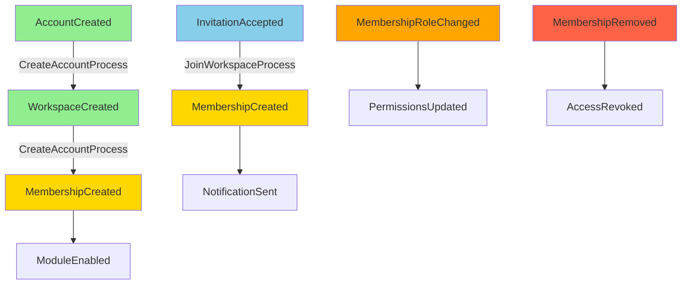

## Mission

守護身份 / 工作區 / 模組啟用的前置條件。此 package 必須保持純 TypeScript，禁止依賴 `@ng-events/core-engine` 或任何 SDK。

## Guardrails

- 禁止引入 Angular、Firebase 或任何 SDK。
- 任務 / 付款 / 議題等業務邏輯留在 `saas-domain`；本層只決定哪些工作區與模組被允許。
- 事件流程遵循 `AccountCreated → WorkspaceCreated → MembershipCreated → ModuleEnabled`，補償事件為暫停/封存/移除/停用。

## Current + Planned Structure

```
account-domain/
└── src/
    ├── aggregates/        # account / workspace / module-registry 等聚合
    ├── value-objects/     # 角色、模組型別、工作區型別
    ├── events/            # DomainEvent 介面與 metadata 工具
    ├── policies/          # 跨聚合守則（如模組啟用檢查）
    ├── domain-services/   # 無狀態的領域服務
    ├── repositories/      # 介面定義
    ├── entities/          # Entity 基礎型別
    ├── types/             # 共用識別符
    └── __tests__/         # 聚合 / VO 測試（新增實作時補齊）
```

> 未來新增的 membership / invitation / policy 請直接放在 `src/` 對應子資料夾，避免再次出現平行根目錄。

## Saga Flow Diagram



## Principles

1. **不可變 + 驗證先行**：VO/Entity 確保型別安全與不變條件。
2. **單一入口**：所有程式碼集中於 `src/`；新增聚合與事件一律走此路徑。
3. **清晰依賴**：零跨層依賴；不上 UI / 平台 SDK / core-engine。
4. **文件先行**：新增聚合前，更新 README/AGENTS 以對齊 Mermaid 架構文件。
