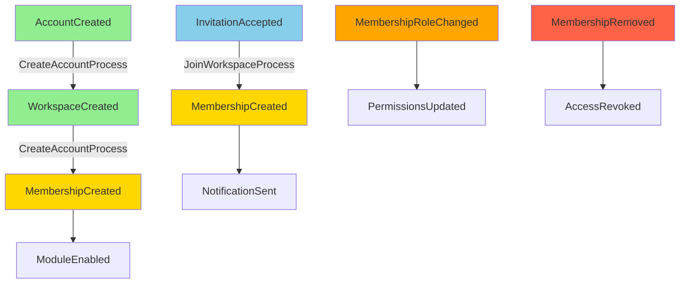

# account-domain AGENTS

> 依據 [`packages/AGENTS.md`](../AGENTS.md) 的邊界；規劃工作前請在對話中呼叫 **server-sequential-thinking** + **software-planning-mcp** 產生執行步驟。

## 角色與依賴
- 身份 / 帳號 / 工作區 / 模組啟用的前置條件（Account → Workspace → Module → Entity）。
- 站在依賴鏈最底層，被 `saas-domain` / `core-engine` 消費，**不向上依賴任何人**。

## 可以放什麼（全部集中在 `src/`）
- Aggregates：Account、Workspace、Module Registry 等
- Entities / Value Objects
- Domain Services / Policies（如模組啟用檢查）
- Domain Events（含 metadata helper）
- Repository Interfaces（介面定義）

## 絕對不能出現
- Firebase / HTTP / 任何 SDK / Angular
- 持久層實作、DTO、DB schema
- 直接 new Date()/uuid（需由 factory 注入）

## 結構（現況 + 預備）
```
account-domain/
└── src/
    ├── aggregates/
    ├── value-objects/
    ├── events/
    ├── policies/
    ├── domain-services/
    ├── repositories/
    ├── entities/
    ├── types/
    └── __tests__/
```
> 新增 membership / invitation / policy 請直接放在上列子資料夾，禁止再開平行根目錄。

## Saga Flow（對齊 Mermaid 架構圖）


## 原則
1. 單一入口：所有程式碼放在 `src/`，新增前先更新 README/AGENTS。
2. 不變與驗證：VO/Entity 維持型別安全與不變條件。
3. 清晰依賴：零跨層依賴，純 TypeScript，禁止 SDK。
4. 文件先行：修改聚合 / 事件前，先同步 Mermaid 架構文件。
