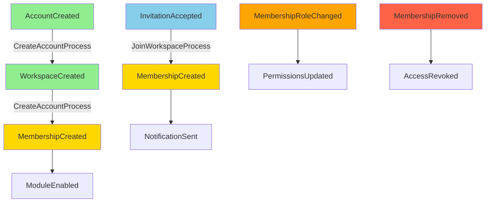

# account-domain

> 🧠 **Identity & Account Core Domain** — Pure TypeScript domain model for identity, accounts, organizations, workspaces, and module enablement.

## Mission

Guard the existence conditions for the SaaS world: accounts, workspaces, memberships, and enabled modules. This package must remain **pure TypeScript** with **zero cross-package dependencies** and free of framework SDKs.

## Overview

`account-domain` models the foundational layer of the multi-tenant SaaS platform:

- **Account**: Root identity for authentication
- **Organization**: Billing and ownership boundary  
- **User**: Individual user profile
- **Workspace**: Isolated environment where SaaS modules run
- **Membership**: Binds a user to a workspace with a role
- **Module Registry**: Lists capabilities (task/issue/payment, etc.) enabled per workspace

## Folder Structure

```
account-domain/
├── src/
│   ├── aggregates/        # Account / Workspace / ModuleRegistry aggregates
│   ├── value-objects/     # Roles, module types, workspace types
│   ├── events/            # Domain events + metadata helpers
│   ├── policies/          # Cross-aggregate guards (module enablement checks)
│   ├── repositories/      # Interfaces only (implementation in platform-adapters)
│   ├── entities/          # Base entity helpers
│   ├── domain-services/   # Stateless domain logic
│   └── types/             # Shared identifiers (AccountId, WorkspaceId, etc.)
├── __tests__/             # Domain tests
├── package.json
└── README.md
```

**All domain code lives under `src/`** to keep a single, predictable entry point—no parallel `account/`, `workspace/`, or `module-registry/` folders.

## Domain Responsibilities

### Account Aggregate

- Provision and suspend the SaaS account
- Gates workspace creation
- Tracks account status (Active, Suspended, Deleted)

```typescript
export class Account extends AggregateRoot {
  private constructor(
    public readonly id: AccountId,
    public readonly email: Email,
    public readonly status: AccountStatus,
    public readonly createdAt: string
  ) {
    super();
  }

  static create(id: AccountId, email: Email, createdAt: string): Account {
    const account = new Account(id, email, AccountStatus.Active, createdAt);
    account.addDomainEvent(new AccountCreated(id, email, createdAt));
    return account;
  }

  suspend(): void {
    if (this.status === AccountStatus.Suspended) {
      throw new DomainError('Account already suspended');
    }
    this.status = AccountStatus.Suspended;
    this.addDomainEvent(new AccountSuspended(this.id));
  }
}
```

### Workspace Aggregate

- Represents the isolated environment where SaaS modules run
- Ties back to an account
- Controls module enablement
- Manages workspace lifecycle (Active, Archived)

```typescript
export class Workspace extends AggregateRoot {
  private enabledModules: Set<ModuleType> = new Set();

  enableModule(moduleType: ModuleType): void {
    if (this.enabledModules.has(moduleType)) {
      throw new DomainError(`Module ${moduleType} already enabled`);
    }
    this.enabledModules.add(moduleType);
    this.addDomainEvent(
      new ModuleEnabled(this.id, this.accountId, moduleType)
    );
  }

  isModuleEnabled(moduleType: ModuleType): boolean {
    return this.enabledModules.has(moduleType);
  }
}
```

### Membership Entity

- Binds a user to a workspace with a role
- Roles: `Owner | Admin | Member | Viewer`
- Controls access permissions

```typescript
export class Membership extends Entity {
  constructor(
    public readonly workspaceId: WorkspaceId,
    public readonly userId: UserId,
    private role: Role,
    public readonly joinedAt: string
  ) {
    super();
  }

  changeRole(newRole: Role): void {
    if (this.role === newRole) {
      throw new DomainError('User already has this role');
    }
    const oldRole = this.role;
    this.role = newRole;
    this.addDomainEvent(
      new MembershipRoleChanged(
        this.workspaceId,
        this.userId,
        oldRole,
        newRole
      )
    );
  }

  hasPermission(permission: Permission): boolean {
    return this.role.hasPermission(permission);
  }
}
```

### Module Registry

- Lists available module types (Task, Issue, Finance, Quality, Acceptance)
- Defines module dependencies
- Validates module enablement prerequisites

```typescript
export class ModuleRegistry {
  private static dependencies: Map<ModuleType, ModuleType[]> = new Map([
    [ModuleType.Finance, [ModuleType.Task]],
    [ModuleType.Quality, [ModuleType.Issue]],
    [ModuleType.Acceptance, [ModuleType.Task]],
  ]);

  static canEnable(
    moduleType: ModuleType,
    enabledModules: Set<ModuleType>
  ): boolean {
    const requiredModules = this.dependencies.get(moduleType) || [];
    return requiredModules.every(required => enabledModules.has(required));
  }
}
```

## Event & Time Conventions

- Aggregates record `createdAt` (string, ISO 8601) as their creation timestamp
- Events use `occurredAt` (string, ISO 8601) for when the event happened
- Events may carry `causationId` (event that caused this event) and `correlationId` (original request/command ID) for causality tracking

```typescript
export interface DomainEvent {
  eventId: string;
  eventType: string;
  aggregateId: string;
  occurredAt: string; // ISO 8601
  causationId?: string;
  correlationId?: string;
  metadata?: Record<string, unknown>;
}
```

## Event Flow Alignment

The onboarding flow follows a strict saga pattern:

```
1️⃣ AccountCreated
    ↓
2️⃣ WorkspaceCreated
    ↓
3️⃣ MemberJoinedWorkspace (Owner role)
    ↓
4️⃣ ModuleEnabled (default modules)
    ↓
SaaS modules become usable
```

Compensation events protect against partial onboarding:
- `AccountSuspended`
- `WorkspaceArchived`
- `MembershipRemoved`
- `ModuleDisabled`

## Saga Flow Diagram



## Usage Guidelines

### Import Patterns

```typescript
// ✅ GOOD - Import from domain package
import { Account, AccountId } from '@account-domain/aggregates/account';
import { Email } from '@account-domain/value-objects/email';
import { AccountRepository } from '@account-domain/repositories/account.repository';

// ❌ BAD - SDK imports forbidden
import { Firestore } from 'firebase-admin/firestore'; // NO!
import { Injectable } from '@angular/core'; // NO!
```

### Repository Pattern

Domain defines interfaces, platform-adapters implements:

```typescript
// ✅ In account-domain/repositories/account.repository.ts
export interface AccountRepository {
  save(account: Account): Promise<void>;
  findById(id: AccountId): Promise<Account | null>;
  findByEmail(email: Email): Promise<Account | null>;
}

// ✅ In platform-adapters/persistence/firestore-account.repository.ts
export class FirestoreAccountRepository implements AccountRepository {
  constructor(private firestore: Firestore) {}

  async save(account: Account): Promise<void> {
    const doc = this.mapToFirestoreDoc(account);
    await this.firestore.collection('accounts').doc(account.id).set(doc);
  }
}
```

### Domain Service Example

```typescript
// ✅ Stateless domain service
export class WorkspaceCreationService {
  canCreateWorkspace(account: Account): boolean {
    return account.status === AccountStatus.Active;
  }

  validateWorkspaceName(name: string): void {
    if (!name || name.trim().length < 3) {
      throw new DomainError('Workspace name must be at least 3 characters');
    }
    if (name.length > 50) {
      throw new DomainError('Workspace name must be less than 50 characters');
    }
  }
}
```

## Anti-Patterns

### ❌ DO NOT

```typescript
// ❌ BAD - SDK in domain
import { Firestore } from 'firebase-admin/firestore';
export class Account {
  async save() {
    await Firestore().collection('accounts').add(this); // NO!
  }
}

// ❌ BAD - Non-deterministic time
export class Account {
  static create(id: AccountId, email: Email) {
    const createdAt = new Date().toISOString(); // NO! Inject time
    return new Account(id, email, AccountStatus.Active, createdAt);
  }
}

// ❌ BAD - Mutable value object
export class Email {
  constructor(public value: string) {} // NO! Should be readonly
  
  changeValue(newValue: string) { // NO! Value objects are immutable
    this.value = newValue;
  }
}
```

### ✅ DO

```typescript
// ✅ GOOD - Pure domain aggregate
export class Account {
  private constructor(
    public readonly id: AccountId,
    public readonly email: Email,
    private status: AccountStatus,
    public readonly createdAt: string
  ) {}

  static reconstitute(/* params */): Account {
    return new Account(/* params */);
  }
}

// ✅ GOOD - Factory with injected dependencies
export class AccountFactory {
  constructor(
    private idGenerator: IdGenerator,
    private clock: Clock
  ) {}

  create(email: Email): Account {
    const id = this.idGenerator.generate();
    const createdAt = this.clock.now();
    return Account.reconstitute(id, email, AccountStatus.Active, createdAt);
  }
}

// ✅ GOOD - Immutable value object
export class Email {
  private constructor(public readonly value: string) {
    this.validate();
  }

  static create(value: string): Email {
    return new Email(value);
  }

  private validate(): void {
    if (!this.value || !this.value.includes('@')) {
      throw new DomainError('Invalid email format');
    }
  }

  equals(other: Email): boolean {
    return this.value === other.value;
  }
}
```

## Testing Guidelines

### Unit Tests

```typescript
// ✅ Pure unit test - no mocks needed
describe('Account', () => {
  it('should create active account with domain event', () => {
    const id = AccountId.create('123');
    const email = Email.create('test@example.com');
    const account = Account.create(id, email, '2024-01-01T00:00:00Z');

    expect(account.status).toBe(AccountStatus.Active);
    expect(account.getDomainEvents()).toHaveLength(1);
    expect(account.getDomainEvents()[0]).toBeInstanceOf(AccountCreated);
  });

  it('should throw when suspending already suspended account', () => {
    const account = Account.reconstitute(
      AccountId.create('123'),
      Email.create('test@example.com'),
      AccountStatus.Suspended,
      '2024-01-01T00:00:00Z'
    );

    expect(() => account.suspend()).toThrow('Account already suspended');
  });
});
```

## Principles

1. **Immutable + Validation First**: VOs/Entities ensure type safety and invariants
2. **Single Entry Point**: All code lives under `src/`; new aggregates and events follow this path
3. **Clear Dependencies**: Zero cross-layer dependencies; no UI, platform SDK, or core-engine imports
4. **Documentation First**: Update README/AGENTS before adding new aggregates to align with Mermaid architecture docs

## Planned Additions

- Membership / Invitation policies aligned with Workspace onboarding
- Module enablement dependency rules (task/issue/finance/quality/acceptance) in `policies/`
- Read model / projection contracts (stay outside domain; account-domain only defines events and aggregates)

## Related Documentation

- [packages/AGENTS.md](../AGENTS.md) - Package boundary rules
- [packages/README.md](../README.md) - Monorepo architecture overview
- [AGENTS.md](AGENTS.md) - AI generation guidelines for this package

## License

MIT
